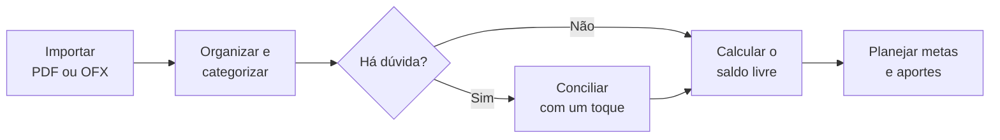
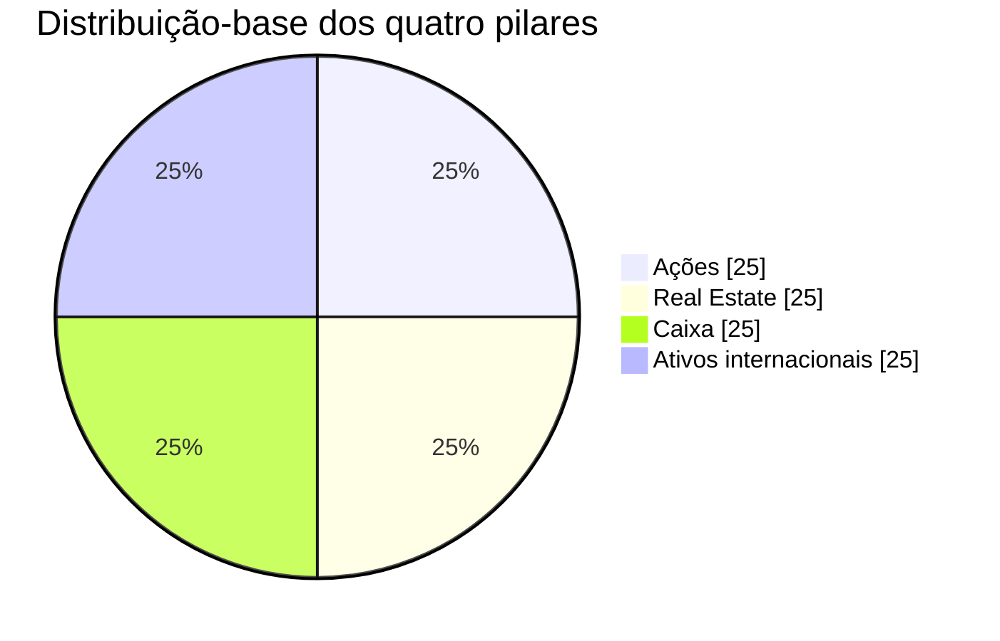
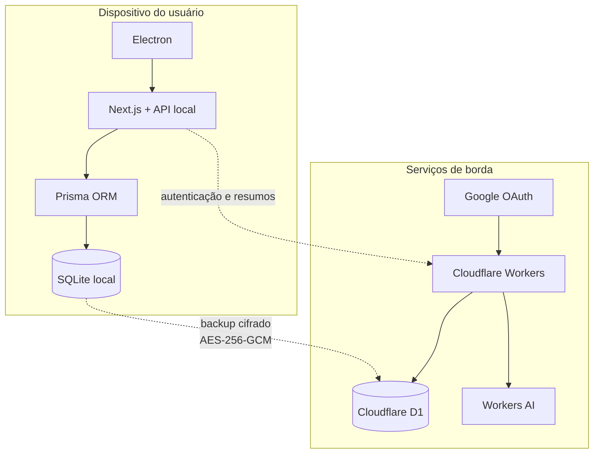

<div align="center">
  <picture>
    <source media="(prefers-color-scheme: dark)" srcset="./icon-talentum-dark.svg">
    <source media="(prefers-color-scheme: light)" srcset="./icon-talentum-light.svg">
    
  </picture>

  # Talentum

  **Seu piloto automático financeiro, local-first e open-source.**

  [](#estado-do-projeto)
  [](#arquitetura)
  [](#privacidade-por-princípio)
  [](#como-contribuir)
</div>

> *Talentum* vem do latim: uma unidade de grande valor e, por extensão, aquilo que nos foi confiado para administrar e multiplicar.

O Talentum nasce para quem quer cuidar melhor do dinheiro, mas não tem tempo para alimentar planilhas ou classificar cada compra manualmente. O aplicativo pretende importar extratos, organizar transações, antecipar compromissos e transformar dados financeiros em próximos passos claros — mantendo os dados sensíveis no dispositivo do usuário.

> [!IMPORTANT]
> O projeto está em fase inicial de especificação e estruturação. As telas e capacidades descritas abaixo representam a visão do produto e não devem ser interpretadas como funcionalidades já disponíveis.

## O problema que queremos resolver

O saldo exibido pelo banco raramente conta a história inteira. Faturas, assinaturas, débitos automáticos e metas futuras competem pelo mesmo dinheiro; ao mesmo tempo, registrar tudo à mão cria uma rotina que poucas pessoas conseguem sustentar.

O Talentum propõe um fluxo de baixa fricção:



## O que compõe o Talentum

| | Área | Para que serve |
| :---: | --- | --- |
|  | **Início** | Resume saldo livre, média de gastos, alertas, progresso e situação da carteira em poucos segundos. |
|  | **Extratos, cartões e benefícios** | Importa PDF/OFX, organiza lançamentos, acompanha faturas, recorrências, anuidade, cashback, milhas e pontos. |
|  | **Conciliação financeira** | Resolve classificações incertas, confere faturas e registra juros, descontos ou gastos em dinheiro. |
|  | **Patrimônio e metas** | Acompanha objetivos, sugere a destinação do superávit e orienta novos aportes pelos quatro pilares. |
|  | **Invest** | Reúne notícias econômicas, prioriza ativos da carteira, produz resumos e preserva o crédito da fonte. |
|  | **Histórico e perfil** | Mantém a timeline, pontos de restauração, exportações, backups, missões, XP, níveis e conquistas. |

Funções globais complementam essas áreas: notificações acionáveis, importação rápida, seleção de conta e lançamento expresso de despesas em espécie.

## Saldo livre, não apenas saldo bancário

Uma das métricas centrais é o **Saldo Livre de Risco**: o valor disponível depois de considerar faturas abertas, contas recorrentes e débitos previstos até o fim do período. A intenção é substituir a falsa sensação de disponibilidade por uma leitura realista do que pode ser gasto.

Quando houver dívidas caras ou saldo negativo, o produto deverá entrar em **modo de sobrevivência**: pausar sugestões de investimento, priorizar a quitação dos juros mais altos e reconstruir a liquidez antes de retomar o planejamento patrimonial.

## Metodologia ARCA

O módulo patrimonial usa como referência a metodologia ARCA, idealizada por **Thiago Nigro (Primo Rico)**. Ela organiza o patrimônio em quatro pilares com meta-base de 25% cada:

| Pilar | Papel na carteira | Exemplos |
| --- | --- | --- |
| **A — Ações** | Crescimento e participação em empresas brasileiras | Ações negociadas na B3 |
| **R — Real Estate** | Exposição imobiliária e geração de renda | Fundos imobiliários e ativos imobiliários |
| **C — Caixa** | Segurança, reserva e liquidez | Tesouro Selic e CDBs com liquidez diária |
| **A — Ativos internacionais** | Diversificação global e proteção cambial | ETFs, BDRs e ativos no exterior |



Para evitar movimentações motivadas por pequenas oscilações, um pilar é considerado equilibrado entre **22,5% e 27,5%**. O motor deverá priorizar novos aportes no pilar mais defasado, sem incentivar vendas desnecessárias.

> [!NOTE]
> O Talentum é uma ferramenta de organização e educação financeira. Ele não oferece recomendação individual de investimento. ARCA e Primo Rico são referências creditadas aos seus respectivos titulares e não indicam afiliação ou endosso ao projeto.

## Privacidade por princípio

Os dados financeiros pertencem ao usuário. A arquitetura planejada separa o que precisa permanecer local do mínimo necessário na nuvem.



- Extratos, transações, estabelecimentos, saldos e carteira ficam no SQLite local.
- A nuvem mantém apenas identidade, metadados essenciais e, quando habilitado, um snapshot já criptografado no dispositivo.
- O backup previsto usa AES-256-GCM e deve seguir um modelo de conhecimento zero.
- O usuário poderá exportar os próprios dados em formatos abertos, como JSON e CSV.

## Arquitetura

O aplicativo desktop será uma experiência full-stack local. O Electron abre e gerencia a janela; o Next.js entrega a interface e os Route Handlers; o Prisma acessa o SQLite no próprio computador.

| Camada | Tecnologia | Responsabilidade planejada |
| --- | --- | --- |
| Desktop | Electron | Empacotamento e janela nativa para Windows e Linux |
| Aplicação | Next.js, React e TypeScript | Interface, renderização e API local |
| Estilo | Tailwind CSS | Sistema visual responsivo |
| Dados | Prisma ORM e SQLite | Persistência local tipada |
| Importação | PDF.js e parser OFX | Extração local de extratos e faturas |
| Identidade | Google OAuth 2.0 | Conta única para landing page e aplicativo |
| Borda | Cloudflare Workers e D1 | Sessão, metadados mínimos, proxy e backup cifrado |
| IA | Cloudflare Workers AI | Resumos objetivos de notícias sem exigir modelos pesados no computador |

## Identidade visual

A marca combina a sobriedade de uma balança com um corte ascendente em âmbar. O repositório mantém duas imagens SVG com transparência real:

| Uso | Arquivo | Cores principais |
| --- | --- | --- |
| Fundos claros | [`icon-talentum-light.svg`](./icon-talentum-light.svg) | Ébano `#1A110A` e âmbar |
| Fundos escuros | [`icon-talentum-dark.svg`](./icon-talentum-dark.svg) | Alabastro e âmbar |

Paleta-base: **Alabastro** `#F4F1EA`, **Ébano** `#1A110A`, **Âmbar clássico** `#B8773D`, **Grafite** `#4A4A4A` e **Nogueira** `#5C4033`.

Os ícones usados neste README pertencem ao [Bootstrap Icons](https://icons.getbootstrap.com/), distribuído sob licença MIT. Novos elementos iconográficos públicos devem manter essa mesma família para preservar consistência.

## Estado do projeto

O repositório está em **pré-alpha**. Hoje ele contém a visão consolidada, documentação, identidade visual, base Next.js full-stack, API REST inicial, Prisma/SQLite, Docker e shell Electron. Os módulos financeiros e serviços Cloudflare ainda serão implementados.

### Roadmap inicial

O plano completo, com MVP, macrofeatures posteriores, dependências e critérios de conclusão, está em [`docs/ROADMAP.md`](./docs/ROADMAP.md). O primeiro release concentra-se em cadastro/download, Electron seguro, persistência local, importação OFX, conciliação e Saldo Livre de Risco.

## Desenvolvimento local

### Pré-requisitos

- Node.js 22.13 ou superior;
- pnpm `11.1.2`;
- Git.

### Preparação

```bash
git clone https://github.com/luizfelipe-pacifico/talentum.git
cd talentum
pnpm install
cp .env.example .env
pnpm prisma:generate
pnpm prisma:migrate
```

### Comandos disponíveis

| Comando | Ação |
| --- | --- |
| `pnpm dev` | Limpa o cache do Next.js, libera a porta 3000 e inicia o servidor local |
| `pnpm dev:all` | Inicia o Next.js e abre a aplicação no Electron |
| `pnpm docker:up` | Constrói e inicia o servidor local em Docker |
| `pnpm docker:down` | Encerra o servidor sem remover o volume SQLite |
| `pnpm build` | Gera a build de produção do Next.js |
| `pnpm start` | Executa a build de produção na porta 3000 |
| `pnpm typecheck` | Verifica os tipos TypeScript |
| `pnpm prisma:generate` | Gera o Prisma Client |
| `pnpm prisma:validate` | Valida o schema Prisma |
| `pnpm prisma:migrate` | Cria e aplica migrações SQLite locais |

O container Ubuntu 24.04 executa o servidor Next.js como usuário não-root; a janela Electron é iniciada no host. Dados SQLite usam um volume nomeado e não entram na imagem.

## Documentação

As fontes técnicas estão indexadas em [`docs/README.md`](./docs/README.md). A arquitetura é separada entre [`Web`](./docs/ARCHITECTURE-WEB.md) e [`Electron`](./docs/ARCHITECTURE-ELECTRON.md); autenticação, refresh tokens e controles obrigatórios estão em [`AUTHENTICATION.md`](./docs/AUTHENTICATION.md) e [`SECURITY.md`](./docs/SECURITY.md).

- [`docs/README.md`](./docs/README.md): índice e hierarquia das fontes de verdade do projeto.
- [`ROADMAP.md`](./docs/ROADMAP.md): MVP e sequência planejada de todas as macrofeatures.
- [`ONBOARDING.md`](./docs/ONBOARDING.md): perguntas e fotografia financeira do primeiro acesso.
- [`ARCHITECTURE.md`](./docs/ARCHITECTURE.md): componentes, limites de confiança e decisões estruturais.
- [`HOW-IT-WORKS.md`](./docs/HOW-IT-WORKS.md): fluxos de execução, importação, conciliação e backup.
- [`DATA_MODEL.md`](./docs/DATA_MODEL.md): modelo conceitual, relações e invariantes de persistência.
- [`API.md`](./docs/API.md): convenções e contratos planejados das APIs local e de borda.
- [`SECURITY.md`](./docs/SECURITY.md): requisitos obrigatórios de segurança e privacidade.
- [`DEVELOPMENT.md`](./docs/DEVELOPMENT.md): ambiente local, comandos e critérios de qualidade.
- [`DOCUMENTACAO_PDF_REESCRITA.md`](./docs/DOCUMENTACAO_PDF_REESCRITA.md): especificação consolidada do produto e da arquitetura.
- [`PROJECT_THINKING.md`](./docs/PROJECT_THINKING.md): decisões iniciais de experiência e tecnologia.
- [`BRANDING.md`](./docs/BRANDING.md): marca, paleta, tipografia e princípios de interface.
- [`BEST_PRACTICES.md`](./docs/BEST_PRACTICES.md): organização, qualidade, segurança e fluxo de contribuição.
- [`DOCUMENTACAO_PDF_TRANSCRICAO.md`](./docs/DOCUMENTACAO_PDF_TRANSCRICAO.md): material histórico que deu origem à visão atual.

## Como contribuir

Contribuições são bem-vindas desde esta fase inicial. Antes de começar:

1. Leia a documentação relacionada à área que pretende alterar.
2. Abra uma issue descrevendo o problema, a proposta e os critérios de aceite.
3. Crie uma branch curta, como `feat/importacao-ofx` ou `docs/privacidade`.
4. Faça mudanças pequenas, sem dados financeiros reais ou credenciais.
5. Execute as verificações disponíveis e descreva o resultado no pull request.
6. Use commits no padrão [Conventional Commits](https://www.conventionalcommits.org/).

Parsers comunitários devem usar amostras sintéticas e anonimizadas. Nunca envie extratos, nomes, documentos, tokens, chaves ou bancos SQLite reais ao repositório.

## Licença e transparência

O Talentum é desenvolvido de forma aberta e aceita colaboração da comunidade. A licença definitiva do código ainda precisa ser formalizada em um arquivo `LICENSE` antes da primeira distribuição pública. Dependências e recursos de terceiros permanecem sob suas respectivas licenças.

---

<div align="center">
  <strong>Clareza para o presente. Disciplina para o futuro.</strong>
</div>
