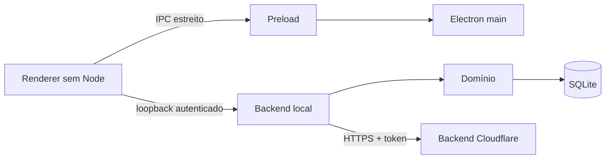

# Arquitetura Electron

## Objetivo

O desktop é local-first: processa e guarda dados financeiros no dispositivo. O renderer é um frontend não confiável e só conversa com o backend local. Serviços cloud recebem apenas o mínimo documentado.

## Estado atual

O Next.js App Router fornece a interface e a API local das features 1–8. Prisma está configurado para SQLite local. No Compose, o banco fica no volume persistente `talentum-data`; o container aplica as migrações antes de iniciar o backend. Docker executa somente o servidor local; o Electron gráfico continua no host e abre o endereço loopback configurado.

As tabelas financeiras, o importador CSV/OFX, a conciliação, o Dashboard e a timeline estão implementados. A interface não apresenta fixtures como se fossem dados da pessoa usuária: ausência de registros produz estado vazio ou desconhecido, nunca um zero inventado.

O onboarding planejado está definido em [`ONBOARDING.md`](./ONBOARDING.md). Salário, instituições, saldos, chaves PIX, extratos, transações, dívidas e investimentos permanecem exclusivamente no dispositivo e passam somente pela API local.

## Fronteiras

- **Renderer:** `nodeIntegration: false`, `contextIsolation: true`, sandbox ativo e CSP restritiva.
- **Preload:** API mínima por método; nunca expõe `ipcRenderer`, filesystem ou shell genéricos.
- **Main:** valida remetente, argumentos, origem e destino em cada IPC.
- **Backend local:** bind em loopback, porta aleatória quando viável e segredo efêmero por execução.
- **SQLite:** acessível somente pela persistência do backend local.
- **Cloud:** acessível somente pelo backend local, nunca pelo renderer.

## Autenticação

O Electron é cliente público: nenhum client secret embutido é confidencial. Usa navegador do sistema, Authorization Code com PKCE S256, `state`, `nonce` e redirect registrado. Access token fica em memória; refresh token rotativo fica no cofre do sistema operacional quando disponível.

## Controles obrigatórios

1. Não carregar conteúdo remoto em janela privilegiada.
2. Negar navegação e novas janelas por padrão.
3. Validar allowlist antes de `shell.openExternal`.
4. Manter `webSecurity` e negar conteúdo misto.
5. Negar permissões não previstas.
6. Validar remetente e schema de todo IPC.
7. Preferir protocolo customizado seguro a `file://`.
8. Desabilitar recursos Electron não usados por fuses.
9. Assinar pacotes, atualizações e manifestos.
10. Nunca enviar finanças em claro à comunidade ou backend cloud.
