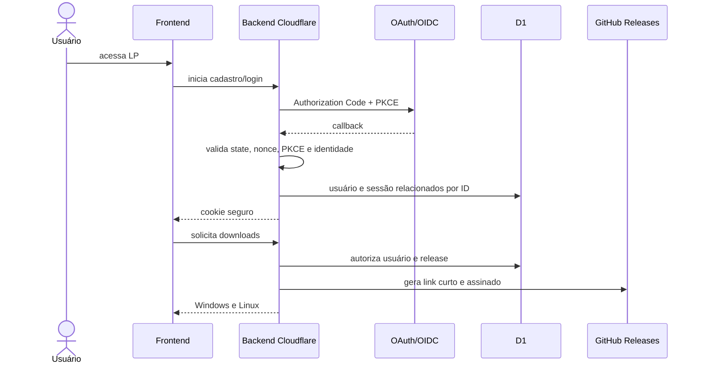
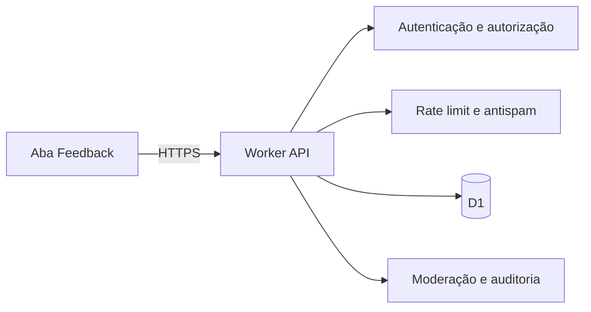

# Arquitetura web

## Escopo

A web entrega a landing page pública, autentica/cadastra o usuário e, após validação no backend, libera downloads para Windows e Linux. Usuários autenticados também participam da comunidade pública de feedback.

## Fluxo de cadastro e download

## Fluxo de feedback

Todos podem ler conteúdo com estado `PUBLISHED`. Criar post, comentar, curtir e denunciar exige sessão. O backend aplica propriedade, moderação, limites e sanitização; o frontend nunca escreve no D1 diretamente.

## Componentes

- **Vercel (`talentum.vercel.app`):** somente código da LP, página de downloads e BFF mínimo de sessão; nenhum módulo financeiro ou código do aplicativo Electron.
- **Worker:** OAuth/OIDC, sessão, comunidade, rate limit, auditoria e emissão de downloads.
- **D1:** identidade mínima, sessões, feedback e metadados.
- **GitHub Releases:** instaladores assinados de Windows e Linux produzidos pelo pipeline de release.
- **Borda:** TLS, WAF, Turnstile e cabeçalhos de segurança.

## Implantação

A interface web será publicada em `https://talentum.vercel.app`. O backend permanece em Cloudflare Workers; o D1 nunca é acessado diretamente pelo navegador.

Como `vercel.app` e `workers.dev` são sites diferentes, o navegador não deve depender de refresh cookie third-party. Um BFF mínimo na Vercel mantém o cookie first-party `Secure`, `HttpOnly` e encaminha chamadas autenticadas ao Worker. Esse BFF não possui regra financeira, banco próprio ou acesso a dados locais; ele existe apenas para sessão, código efêmero e proxy controlado.

O projeto Vercel recebe somente os arquivos necessários à LP/BFF. O shell Electron, backend local, Prisma, SQLite, parsers, módulos financeiros, testes desktop e arquivos internos de empacotamento são excluídos do contexto de deploy. Preferir projeto/repositório de deploy isolado ou artefato de origem allowlisted; não conectar a raiz completa do sistema à Vercel.

Os instaladores assinados de Windows e Linux são produzidos pelo pipeline e publicados em GitHub Releases. Após validar a sessão, o backend registra uma concessão curta no D1 e retorna o endereço do artefato. Como releases de um repositório open-source são públicos, a concessão controla a experiência da LP e a auditoria, mas não transforma o binário em conteúdo privado. A LP não contém nem executa o sistema desktop.

## Critérios de aceite

- `/downloads` não abre sem sessão válida;
- frontend não contém segredos nem token persistente acessível a JavaScript;
- manifesto do deploy comprova que nenhum arquivo do sistema desktop foi enviado à Vercel;
- concessões de download expiram e são auditadas; artefatos públicos mantêm checksum e assinatura;
- conteúdo público de feedback nunca revela e-mail, token, IP ou identificador OAuth;
- ações da comunidade são autorizadas e limitadas no backend;
- respostas privadas usam `Cache-Control: no-store`.
