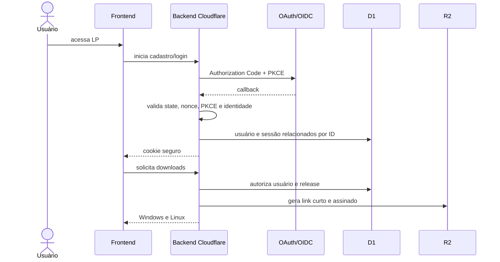
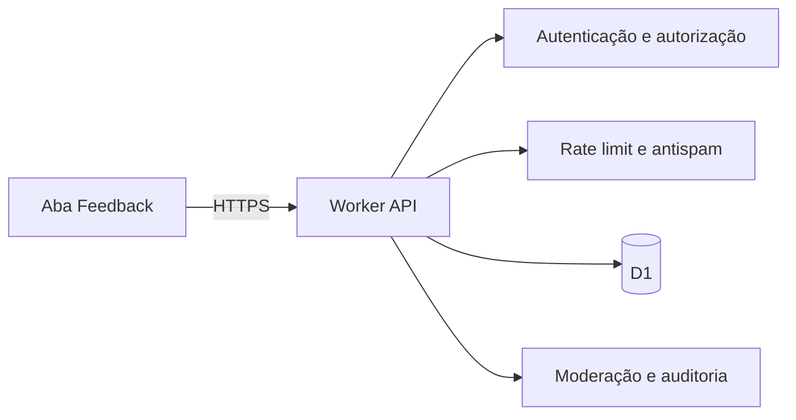

# Arquitetura web

## Escopo

A web entrega a landing page pública, autentica/cadastra o usuário e, após validação no backend, libera downloads para Windows e Linux. Usuários autenticados também participam da comunidade pública de feedback.

## Fluxo de cadastro e download

## Fluxo de feedback

Todos podem ler conteúdo com estado `PUBLISHED`. Criar post, comentar, curtir e denunciar exige sessão. O backend aplica propriedade, moderação, limites e sanitização; o frontend nunca escreve no D1 diretamente.

## Componentes

- **Frontend:** páginas públicas/protegidas; nenhum segredo, cliente de banco ou decisão de autorização.
- **Worker:** OAuth/OIDC, sessão, comunidade, rate limit, auditoria e emissão de downloads.
- **D1:** identidade mínima, sessões, feedback e metadados.
- **R2:** instaladores assinados e anexos futuros aprovados; nenhum upload de feedback no MVP.
- **Borda:** TLS, WAF, Turnstile e cabeçalhos de segurança.

## Implantação

Cloudflare Pages serve apenas um export estático. Como este fluxo exige backend, sessão, D1 e R2, a opção Cloudflare é **Workers**. Veja [`decisions/0001-web-hosting.md`](./decisions/0001-web-hosting.md).

## Critérios de aceite

- `/downloads` não abre sem sessão válida;
- frontend não contém segredos nem token persistente acessível a JavaScript;
- links de artefatos expiram e são auditados;
- conteúdo público de feedback nunca revela e-mail, token, IP ou identificador OAuth;
- ações da comunidade são autorizadas e limitadas no backend;
- respostas privadas usam `Cache-Control: no-store`.
