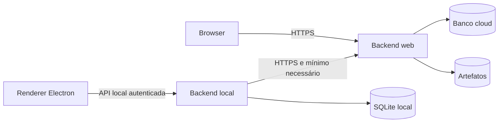

# Arquitetura geral do Talentum

## Status

Arquitetura-alvo planejada. O repositório ainda contém somente o shell inicial do Electron e dependências-base; os serviços descritos abaixo não devem ser considerados implementados.

## Regra central

Toda interface é um cliente não confiável. O navegador e o renderer do Electron nunca acessam banco, Prisma, armazenamento, OAuth ou serviços privilegiados diretamente. Toda leitura e escrita passa por um backend documentado, validado e autorizado.

Há duas arquiteturas deliberadamente separadas:

- [`ARCHITECTURE-WEB.md`](./ARCHITECTURE-WEB.md): LP, cadastro, autenticação, downloads e comunidade de feedback;
- [`ARCHITECTURE-ELECTRON.md`](./ARCHITECTURE-ELECTRON.md): aplicativo local-first, API local e integrações remotas.

A Vercel hospeda exclusivamente a LP em `talentum.vercel.app` e um BFF mínimo necessário para cookies first-party. O sistema financeiro e o Electron não são implantados nem incluídos no contexto de build da Vercel. Instaladores Windows/Linux são publicados em GitHub Releases; o D1 guarda apenas metadados e concessões por ID.



## Regras normativas

1. Cada operação de frontend corresponde a um endpoint ou comando de backend documentado.
2. Nenhuma regra de autorização existe somente no frontend.
3. Toda tabela persistida possui `id`; relações usam chaves estrangeiras por ID.
4. Dados financeiros primários permanecem locais; sincronização nova exige revisão de privacidade e ameaça.
5. Dados confidenciais não são enviados ao frontend. Criptografia não torna seguro expor algo desnecessário.
6. Mudanças em arquitetura, API, schema ou segurança atualizam a documentação no mesmo pull request.
7. Integrações externas usam adaptadores, timeout, validação de resposta e falha segura.

## Responsabilidades

| Camada | Pode | Não pode |
| --- | --- | --- |
| Frontend web | renderizar dados públicos e respostas autorizadas | conter segredos, consultar banco ou decidir autorização |
| Backend web | autenticar, autorizar, limitar e persistir dados cloud | receber finanças em claro sem caso aprovado |
| Renderer Electron | exibir estado e chamar contratos permitidos | usar Node, Prisma, filesystem ou token persistente diretamente |
| Backend local | executar domínio, persistir finanças e integrar com cloud | confiar em entrada do renderer |
| Processo principal | capacidades nativas mínimas via preload | expor IPC genérico ou carregar conteúdo remoto privilegiado |

## Organização-alvo

```text
apps/
  web/                 LP e frontend web
  desktop/             interface local
electron/              main, preload e capacidades nativas
packages/
  contracts/           schemas compartilhados sem segredos
  domain/              regras de negócio
  db-local/            Prisma/SQLite e migrações
workers/               backend Cloudflare, se a ADR for confirmada
docs/                  fontes normativas e decisões
```

## Documentos relacionados

- [`AUTHENTICATION.md`](./AUTHENTICATION.md)
- [`SECURITY.md`](./SECURITY.md)
- [`DATA_MODEL.md`](./DATA_MODEL.md)
- [`decisions/0001-web-hosting.md`](./decisions/0001-web-hosting.md)
