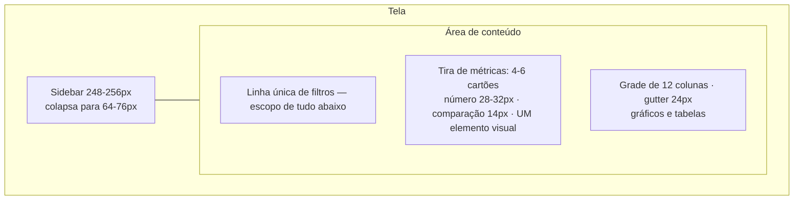
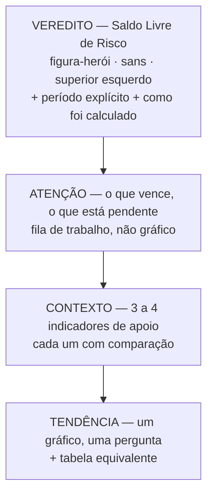

# Dashboard e visualização de dados

## Status e finalidade

Documento **normativo** para o desenho de qualquer painel, indicador, gráfico ou tabela financeira do Talentum. Ele nasce de três fontes que foram cruzadas deliberadamente:

1. os padrões observados nos dez dashboards de sistema mais bem avaliados por usuários em 2026;
2. o método de *Storytelling with Data*, de Cole Nussbaumer Knaflic, adotado como base teórica;
3. a auditoria medida do dashboard atual do repositório.

Estados usados, conforme [`README.md`](./README.md):

- **Atual:** existe e foi verificado no repositório.
- **Planejado:** decisão aceita, ainda sem implementação.
- **Em aberto:** exige ratificação do mantenedor antes da implementação.

Este documento não descreve funcionalidade pronta. O dashboard descrito na parte 4 é **planejado**; o dashboard auditado na parte 3 é **atual**.

Documentos relacionados: [`BRANDING.md`](./BRANDING.md) é a fonte de verdade da identidade visual e prevalece sobre este texto em qualquer conflito de cor, tipografia ou espaçamento não resolvido aqui. [`ROUTING_MVP.md`](./ROUTING_MVP.md) define o contrato da Feature 7 (Dashboard). [`API.md`](./API.md) define os contratos que alimentam a tela.

---

# Parte 1 — Referência: os dez dashboards mais bem avaliados

## Os produtos analisados

Recorte de 2026 sobre dashboards de sistema com avaliação pública consolidada de usuários. A coluna "decisão característica" registra o que cada produto faz de forma distinta, não um elogio genérico.

| # | Produto | Domínio | Decisão característica |
| --- | --- | --- | --- |
| 1 | **Linear** | gestão de trabalho | Superfícies quase monocromáticas, **uma** cor de destaque. Densidade alta sem sensação de aperto porque tudo o que não é essencial simplesmente não está na tela. |
| 2 | **Stripe** | pagamentos | Tabela como interface primária; gráfico como resumo. Numerais tabulares alinhados à direita, gridlines suaves. Uma métrica-herói visualizada. |
| 3 | **Vercel** | observabilidade | Sistema preto e branco: a hierarquia vem inteiramente de espaçamento e peso tipográfico. Cores de status ganham peso semântico porque nada mais compete. |
| 4 | **Attio** | CRM | Saída de IA como componente desenhado, integrado ao registro — não como balão de chat sobreposto. |
| 5 | **PostHog** | analytics de produto | *Insight cards*: cada visualização responde a uma pergunta e enuncia essa pergunta no título. |
| 6 | **Hex** | notebooks e apps de dados | Publicação de notebook como app: células limpas, gráficos contidos, espaço em branco generoso. |
| 7 | **Retool** | ferramentas internas | Planura deliberada. Grade estrita de componentes; familiaridade vence novidade. |
| 8 | **Mercury** | fintech | Tipografia editorial e cor disciplinada aplicadas a dado financeiro. Calma visual como construção de confiança. |
| 9 | **Plausible** | analytics web | Simplicidade radical: uma página, um gráfico, algumas listas ranqueadas, zero configuração obrigatória. |
| 10 | **Supabase** | console de plataforma | Um único template de página (cabeçalho, abas, tabela) reaproveitado por muitas ferramentas; sidebar disciplinada. |

Complementarmente, foram examinados dashboards financeiros de **Ramp**, **Brex**, **Wise Business**, **Revolut Business** e **Plaid**, por proximidade direta com o domínio do Talentum.

## Padrões cruzados — as boas práticas

O que aparece em **quase todos** os dez. Estas são as regras que o Talentum adota.

### BP-1. Um veredito por tela

Existe **uma** métrica que o usuário abriu o dashboard para ver. Ela recebe o maior corpo tipográfico e a posição superior esquerda. Todo o resto é subordinado. Nenhuma tela apresenta doze widgets de peso equivalente. O teste operacional é o **teste dos cinco segundos**: uma pessoa deve identificar o estado principal em cerca de cinco segundos.

### BP-2. Teto de indicadores

Um indicador primário por visão, mais um punhado de secundários. A faixa praticada é de **4 a 6 cartões** na tira de métricas, com limite superior em torno de **5 a 7** elementos acima da dobra — o limite de memória de trabalho (7±2 de Miller). Plausible e Mercury vencem justamente por se recusarem a mostrar tudo.

### BP-3. Divulgação progressiva

Mostrar o mínimo necessário para a próxima decisão. Resumo primeiro, detalhe sob demanda. Stripe e PostHog enterram complexidade atrás de um clique em vez de exibi-la na primeira pintura.

### BP-4. Contenção de gráficos

Uma tendência significativa vence cinco decorativas. Números bem compostos em tabela comunicam mais rápido que gráficos. Há um movimento claro de retorno à tabela estruturada — "as tabelas retomaram o trono". Investir mais onde o usuário passa o tempo.

### BP-5. Cor é canal de sinal, não decoração

A cor significa **estado**, e nada mais. Em Stripe, "a cor só significa estado: aprovado, estornado, falhou". A cor da marca pertence ao *chrome* da interface, não à visualização de dados. Verde e vermelho ficam reservados a ganho e perda.

### BP-6. Numerais são um sistema, não um detalhe

Figuras tabulares, casas decimais consistentes, alinhamento à direita para valores financeiros. O símbolo de moeda recebe peso mais leve que o valor. Figuras proporcionais que "tremem de coluna para coluna" leem como amadorismo. Em interfaces escuras, a regra é ainda mais dura: **UIs financeiras escuras vivem ou morrem pela legibilidade dos numerais**.

### BP-7. Estados são componentes, não sobras

Os *skeletons* da Vercel e os estados vazios do Retool carregam tanto esforço de desenho quanto as visões com dado. Três estados são obrigatórios por componente: carregando (esqueleto com a forma do conteúdo), vazio (explicação de uma frase + ação) e erro (faixa no próprio componente, com repetição — nunca um modal de página inteira). O estado vazio é uma superfície de *onboarding*.

### BP-8. Chrome silencioso, densidade alta

Bordas, sombras e decoração encolhem; a densidade de informação sobe. Hierarquia se constrói com **peso, tamanho e espaço em branco**, não com caixas. Em modo claro, fundo levemente quente para superfícies grandes e branco puro reservado a cartões de conteúdo.

### BP-9. Densidade é configuração, não filosofia

Usuários intensos querem linhas compactas; usuários ocasionais querem respiro. Entregar um alternador confortável/compacto em vez de arbitrar. Linha de tabela: **36–40 px** compacta, **48–52 px** confortável.

### BP-10. Tema escuro é um tema, não uma inversão

Linear, Supabase e Vercel tratam o escuro como tema de primeira classe construído sobre *tokens*. Paletas de gráfico exigem redesenho, não inversão CSS: a matemática de contraste é diferente e superfícies mais claras indicam elevação maior (o inverso do modo claro).

### BP-11. Fila de trabalho antes de analítica

Padrão específico de fintech, e o mais relevante para o Talentum. Ramp coloca caixas de entrada de contas e despesas, status de automação e progresso de fechamento no espaço nobre, com analítica um nível abaixo. Brex mostra o que precisa de atenção e esconde o que está em dia. A síntese: **dashboards financeiros são listas de tarefas vestidas de gráficos**.

### BP-12. Transparência é decisão de desenho

Wise expõe tarifas antes de pedir o dinheiro. Desenhar o **estado pendente**: dinheiro em trânsito com UI ambígua gera desconfiança. Carimbos de tempo exatos, quebras de valor explícitas, taxas declaradas.

## Layout consolidado

A estrutura convergente de Stripe, Linear e Vercel:



Especificações verificadas nas referências:

| Elemento | Valor |
| --- | --- |
| Sidebar expandida / colapsada | 256 px / 64 px (Talentum usa **248 px / 76 px** — dentro da faixa, mantido) |
| Item de navegação | altura 36 px, padding lateral 12 px, raio 8 px |
| Cartão de métrica | largura 200–280 px, `auto-fill, minmax(200px, 1fr)` |
| Número primário do cartão | 28–32 px, alto contraste |
| Comparação secundária | 14 px, cor secundária |
| Grade de conteúdo | 12 colunas, gutter 24 px, linha `minmax(200px, auto)` |
| Vãos comuns | tabela cheia `1 / -1`; gráfico + tabela `span 7` + `span 5`; três cartões `span 4` |
| Ponto de quebra primário | 1366 px (Talentum mira 1440×900, mínimo 1024×700) |

---

# Parte 2 — Base teórica: *Storytelling with Data*

Cole Nussbaumer Knaflic, *Storytelling with Data: A Data Visualization Guide for Business Professionals* (Wiley). O livro é organizado em seis lições. Elas são a base teórica do padrão Talentum e valem para toda tela que apresente número.

## Lição 1 — Entenda o contexto

A tese: investir antes de desenhar reduz retrabalho depois. Antes de escolher qualquer visual, responder três perguntas:

- **Quem** é a audiência;
- **O quê** ela precisa saber ou fazer;
- **Como** o dado sustenta isso.

Distinção central: **análise exploratória** (procurar o que há) é diferente de **comunicação explanatória** (mostrar o que importa). Um dashboard é explanatório. Mostrar tudo o que foi encontrado é confundir a audiência com o próprio processo.

Três ferramentas prescritas:

- a **história de três minutos** — o que você diria se tivesse três minutos;
- a **Grande Ideia** (*Big Idea*) — **uma única frase completa**, com ponto de vista próprio, que declara o que está em jogo;
- o **storyboard** — a estrutura e o fluxo antes do pixel.

> **Aplicação ao Talentum.** A Grande Ideia do dashboard é: *"Depois de descontar tudo o que já está comprometido até o fim do período, sobra este valor — e é só ele que você pode gastar."* Todo elemento da tela ou serve a essa frase, ou sai da tela.

## Lição 2 — Escolha um visual eficaz

O conjunto de formas eficazes é pequeno e conhecido.

**Recomendados:** texto simples (um ou dois números), tabela (unidades múltiplas, audiências mistas), *heatmap* (detalhe tabular com pista de cor), gráfico de dispersão (relação entre duas quantitativas), linha (dado contínuo, sobretudo série temporal), *slopegraph* (comparação entre dois períodos), barras verticais e horizontais (categórico; **linha de base zero obrigatória**; horizontal quando os rótulos são longos), barras empilhadas (total e componentes) e *waterfall* (aumentos e reduções sucessivos).

**Desaconselhados, com o motivo:**

| Forma | Por que evitar |
| --- | --- |
| Pizza | O olho humano não compara ângulos com precisão. Tratada no livro como o exemplo canônico do erro. |
| Rosca (*donut*) | Mesma falha da pizza, agravada: compara arcos em vez de ângulos. |
| 3D | Distorce a percepção de magnitude. Só admissível quando existe uma terceira dimensão real no dado. |
| Segundo eixo Y | Impõe esforço cognitivo e sugere correlação que o dado não contém. |

O segundo eixo Y merece nota própria: é o erro número um em dashboards de produção. O alinhamento entre as duas escalas é arbitrário, então o gráfico **inventa** uma relação. Alternativas corretas: dois gráficos, *small multiples*, ou indexar as duas séries a uma base comum (=100 em t₀) em **um** eixo.

## Lição 3 — Elimine a desordem

A tese: a capacidade cognitiva é finita e cada elemento na tela consome parte dela. Todo elemento que ocupa espaço sem aumentar o entendimento é **carga cognitiva desnecessária** e deve sair.

Os **princípios de Gestalt** são a ferramenta para identificar o que é supérfluo:

| Princípio | O que significa | Uso prático |
| --- | --- | --- |
| **Proximidade** | Objetos próximos são percebidos como grupo | Agrupar por espaçamento, não por caixa |
| **Similaridade** | Cor, forma ou tamanho iguais sugerem relação | Cor consistente por entidade em toda a tela |
| **Fechamento** (*enclosure*) | Um fundo sutil separa mais que uma borda | Sombreado leve em vez de contorno |
| **Completude** (*closure*) | A mente completa formas incompletas | Bordas de gráfico são removíveis |
| **Continuidade** | O olho segue linhas implícitas | Barras alinhadas dispensam a linha de base desenhada |
| **Conexão** | Elementos ligados fisicamente formam associação forte | A linha do gráfico conecta mais que a cor |

Táticas concretas: remover bordas de gráfico; afinar e clarear gridlines; empurrar eixos e rótulos para o fundo deixando-os cinza; eliminar marcadores desnecessários; rotular dados diretamente; alinhar texto à esquerda formando linhas verticais limpas; **nunca usar texto diagonal ou rotacionado** — é comprovadamente mais lento de ler.

O espaço em branco é ativo: preservar margens, dimensionar o visual em vez de esticá-lo, e usar o vazio deliberadamente para dar ênfase.

## Lição 4 — Foque a atenção

Depois de limpar, é possível dirigir o olhar. A base é a arquitetura da memória humana:

| Memória | Duração e capacidade | Consequência de desenho |
| --- | --- | --- |
| **Icônica** | milissegundos, inconsciente | É aqui que os atributos pré-atentivos agem |
| **De curto prazo** | cerca de **quatro "blocos"** de informação visual | Mais de quatro grupos por vez satura |
| **De longo prazo** | vida inteira | Imagens ajudam a recuperar informação verbal |

Os **atributos pré-atentivos** são propriedades que o cérebro processa antes da atenção consciente:

- **Forma:** orientação, formato, comprimento, largura, tamanho
- **Cor:** matiz, intensidade/saturação
- **Posição:** localização 2D
- **Movimento:** piscada, direção — *não recomendado* em comunicação explanatória

Distinção operacional: comprimento, posição, tamanho e intensidade codificam **valor numérico**; matiz e formato distinguem **categoria**. Usar matiz para codificar quantidade é gastar o canal errado.

Regras derivadas:

- Desenhar em **tons de cinza** primeiro e então introduzir **uma** cor de destaque. Empurrar tudo o que não é crítico para o cinza claro.
- Destacar **no máximo cerca de 10%** dos elementos. Acima disso o destaque deixa de destacar.
- Usar cor com parcimônia, de forma consistente e com contraste suficiente.
- Projetar para daltonismo: evitar o par vermelho/verde como única distinção; azul e laranja são o par seguro.
- O canto **superior esquerdo** é o imóvel mais valioso da tela.
- Rotular diretamente reduz a consulta ida-e-volta à legenda.
- Variar o tamanho do texto: título maior, nota de rodapé menor.

## Lição 5 — Pense como um designer

**A forma segue a função.** Primeiro decidir o que a audiência precisa fazer com o dado; só então desenhar o que permite fazê-lo.

Quatro conceitos:

- **Affordances** — a forma sugere o uso. Destacar o importante, eliminar distração, criar hierarquia visual explícita.
- **Acessibilidade** — o desenho precisa ser utilizável por pessoas com capacidades diferentes. Não complicar; usar texto generosamente; escrever o texto com cuidado.
- **Estética** — o que é percebido como belo é percebido como mais utilizável e é tolerado por mais tempo. Não é enfeite: é adesão.
- **Aceitação** — mudança de formato encontra resistência. Mostrar o antes e o depois, articular a vantagem, oferecer alternativas, envolver quem vai usar.

## Lição 6 — Conte uma história

Dado sozinho não é lembrado; narrativa é. A estrutura em três atos:

- **Ato I — Preparação:** contexto, personagem principal (a audiência), o incidente que cria a questão dramática.
- **Ato II — Conflito:** o que está em jogo, o atrito, o desenvolvimento.
- **Ato III — Resolução:** o clímax e a resposta à questão dramática — a chamada para ação.

Dois fluxos possíveis: **cronológico** (constrói credibilidade) ou **começar pelo fim** (dá clareza imediata). Em produto, começar pelo fim.

Duas lógicas de composição:

- **Lógica horizontal:** os títulos, lidos em sequência, contam a história inteira. Exige títulos que afirmam algo, não rótulos genéricos.
- **Lógica vertical:** dentro de uma mesma superfície, título, texto e visual se reforçam, sem nada estranho ao ponto.

Táticas de verificação: **storyboard reverso** (percorrer o resultado final e anotar o ponto principal de cada tela — se a lista não conta uma história, a estrutura está errada) e a **perspectiva fresca** (alguém sem contexto olha e descreve o que vê).

> **Aplicação direta.** A regra da lógica horizontal condena rótulos como "Base financeira" ou "Extratos processados". Um título de cartão deve afirmar: "Você tem R$ X livres até dia 30" comunica; "Saldo" não.

---

# Parte 3 — Auditoria do dashboard atual

**Escopo auditado:** [`src/components/demo-pages.tsx:16-33`](../src/components/demo-pages.tsx#L16-L33) (`DashboardPage`), [`src/hooks/use-dashboard-data.ts`](../src/hooks/use-dashboard-data.ts), [`src/app/api/dashboard/route.ts`](../src/app/api/dashboard/route.ts) e os tokens em [`src/app/globals.css`](../src/app/globals.css). Estado: **atual**, verificado no repositório.

## O que existe hoje

Seis cartões, em duas fileiras de três:

| Fileira | Cartão | Conteúdo | Corpo |
| --- | --- | --- | --- |
| 1 | Saldo atual registrado | valor + subtítulo + **botão primário** | `metric-hero`, 36–52 px |
| 1 | Média de gastos diária | valor + subtítulo + *chip* | `metric`, 32 px |
| 1 | Gastos do mês | valor + subtítulo | `metric`, 32 px |
| 2 | Base financeira | contagem + subtítulo + **link** | `metric`, 32 px |
| 2 | Extratos processados | contagem + subtítulo + **botão primário** | `metric`, 32 px |
| 2 | Fila de conciliação | contagem + subtítulo + **link** | `metric`, 32 px |

Acima de tudo, uma linha de status de 12 px em `.note` ([`demo-pages.tsx:21`](../src/components/demo-pages.tsx#L21)).

## Defeitos, por gravidade

### D-1 — CRÍTICO: a tela lidera com a métrica que o produto existe para desacreditar

O número-herói é **"Saldo atual registrado"**. O [`README.md`](../README.md) declara, sobre o Saldo Livre de Risco, que a intenção é *"substituir a falsa sensação de disponibilidade por uma leitura realista do que pode ser gasto"*. O dashboard coloca em 52 px exatamente a falsa sensação de disponibilidade.

O **Saldo Livre de Risco não aparece na tela**. A promessa central do produto está ausente do painel que deveria prová-la. Contra a Lição 1: não há Grande Ideia. Contra BP-1: não há veredito.

### D-2 — CRÍTICO: o estado de erro mente sobre o dinheiro do usuário

[`use-dashboard-data.ts:16-26`](../src/hooks/use-dashboard-data.ts#L16-L26) inicializa `emptyData` com `balance: 'R$ 0,00'`. Em falha, o `catch` chama `setError(true)` ([linha 47](../src/hooks/use-dashboard-data.ts#L47)) — mas `DashboardPage` **nunca lê `error` nos cartões**. Renderiza `data.balance` incondicionalmente.

Consequência verificável: quando a consulta ao banco local falha, a tela exibe **"R$ 0,00 · Nenhuma conta ou transação foi cadastrada"**. O aplicativo afirma, com precisão de duas casas decimais, que o usuário não tem dinheiro — quando na verdade ele falhou em perguntar. Idêntico comportamento durante o carregamento.

Para um produto financeiro este é o pior modo de falha possível. É defeito de correção, não de estética. Viola BP-7 e a regra de estados de [`ROUTING_MVP.md`](./ROUTING_MVP.md) ("todas as telas financeiras... possuem estados vazio, carregando, erro e com dados").

### D-3 — GRAVE: seis widgets de peso equivalente e nenhuma hierarquia

Todos os seis usam a mesma classe `.card` — mesma borda, mesmo raio, mesmo preenchimento. Quatro dos seis usam o mesmo corpo de 32 px. A grade `.dashboard-kpis` é `1.12fr 1fr 1fr` ([`globals.css:270`](../src/app/globals.css#L270)): o herói é **12% mais largo** que os vizinhos — insuficiente para dominar, suficiente para quebrar o ritmo com a fileira `repeat(3, 1fr)` abaixo. Nem alinhado, nem deliberadamente assimétrico.

Além disso, **três dos seis indicadores medem o encanamento do software, não a vida financeira**: número de contas, número de lotes importados, número de pendências. Respondem "o que o programa fez", não "como eu estou". Contra BP-1 e BP-2.

### D-4 — GRAVE: zero contexto comparativo

Nenhum dos seis números tem *delta*, período anterior, meta, linha de base ou *sparkline*. A API não calcula nenhum: não há qualquer ocorrência de comparação temporal em [`route.ts`](../src/app/api/dashboard/route.ts). `R$ 0,00` sem "contra o mês anterior" é ininterpretável.

Isto contradiz a Lição 1 de forma direta — sem contexto, o número não informa — e desperdiça o índice `@@index([profileId, occurredOn])` que já existe no schema exatamente para série temporal.

### D-5 — GRAVE: nenhum gráfico existe no produto

Busca em `src/` por `<svg`, `<canvas`, `recharts`, `d3` ou `sparkline`: **nenhuma ocorrência em tela de produto**. A única visualização do repositório é um gráfico de barras decorativo feito com `div` em [`layout-guide.tsx:895-908`](../src/components/layout-guide.tsx#L895-L908).

Esse único precedente **reprova na validação de paleta**, medido contra as superfícies reais do Talentum:

```
Par atual: Nogueira #5C4033 + Âmbar #B8773D
  claro (#FFFDF8):  FAIL faixa de luminosidade (#5C4033 L=0.399)
                    FAIL piso de croma (#5C4033 C=0.045 — lê como cinza)
  escuro (#2A2622): FAIL piso de croma (#8A6A57 C=0.05)
                    FAIL piso de visão normal — ΔE 9.7, abaixo de 15
```

A última linha é a mais séria: no tema escuro, **mesmo uma pessoa com visão de cores plena tem dificuldade em separar as duas séries**. O par não é uma paleta categórica; são dois marrons vizinhos.

### D-6 — MÉDIO: serifada de display nos números

`.metric` e `.metric-hero` ([`globals.css:950,959`](../src/app/globals.css#L950)) usam `var(--font-display)` — Playfair Display. A própria [`BRANDING.md`](./BRANDING.md) restringe Playfair a "títulos de página, seções principais e resumos numéricos importantes quando o tom editorial for apropriado", e a desaconselha em conteúdo operacional denso. Uma figura-herói de dashboard é conteúdo operacional lido diariamente, não uma capa editorial.

### D-7 — MÉDIO: `tabular-nums` na figura-herói

[`globals.css:966`](../src/app/globals.css#L966) aplica `font-variant-numeric: tabular-nums` a `.metric-hero`, dimensionado em `clamp(36px, 3.5vw, 52px)`. Dígitos de largura fixa deixam números grandes visualmente frouxos. Figuras tabulares servem para **alinhamento vertical** — linhas de tabela e marcas de eixo — não para um número solitário grande. A intenção de BP-6 está certa; a aplicação está no lugar errado.

### D-8 — MÉDIO: a camada de ação invade a camada de fato

Quatro dos seis cartões contêm botão ou link. Dois deles são `btn btn-primary` — âmbar — na mesma tela ([`demo-pages.tsx:23` e `:29`](../src/components/demo-pages.tsx#L23)). [`BRANDING.md`](./BRANDING.md) é explícita: *"Use Classical Amber only for the primary action on a view."* Há duas.

O efeito de desenho é pior que a violação de token: o botão compete com o número pelo mesmo espaço de atenção, e o cartão deixa de responder "quanto" para responder "o que fazer".

### D-9 — MÉDIO: `.chip` significa duas coisas diferentes

O mesmo token visual aparece como "Sem meta configurada" com ícone `bi-dash` dentro de um cartão de métrica, e como "Sem dados importados" na barra superior ([`app-shell.tsx`](../src/components/app-shell.tsx)). Um *chip* que não carrega estado gasta o canal de ênfase sem informar. Contra a Lição 4 (destaque limitado a ~10%) e contra BP-5.

### D-10 — MÉDIO: o dashboard é a única rota sem estado vazio desenhado

`EmptyState` existe em [`demo-pages.tsx:12`](../src/components/demo-pages.tsx#L12) e é usado em **todas** as outras rotas. O dashboard, em vez disso, renderiza seis zeros confiantes. A tela que mais precisa de *onboarding* recebeu o estado vazio menos desenhado — o inverso exato de BP-7.

## Tokens semânticos: o que está certo hoje

A auditoria também confirma acertos. Medição de contraste dos tokens de [`globals.css`](../src/app/globals.css):

| Token | Claro sobre `#FFFDF8` | Escuro sobre `#2A2622` | Veredito |
| --- | --- | --- | --- |
| `--ok` | 6.25:1 | 6.34:1 | Aprovado para texto (AA) |
| `--warn` | 4.82:1 | 6.93:1 | Aprovado para texto (AA) |
| `--err` | 8.97:1 | 5.93:1 | Aprovado para texto (AA) |
| `--info` | 6.89:1 | 6.85:1 | Aprovado para texto (AA) |
| `--ink2` claro / escuro | 8.72:1 | 7.12:1 | Aprovado; a troca Grafite→`#B7B2A9` está correta |
| `--amber` | 3.60:1 | 4.11:1 | Aprovado como marca gráfica (≥3:1) nos dois temas |

Os quatro tokens semânticos são **bem escolhidos para texto**. Porém, como **preenchimento de gráfico** eles reprovam entre si:

```
--err ↔ --ok : ΔE 6.0 sob deuteranopia   (a falha clássica vermelho/verde)
--info ↔ --ok: ΔE 10.1 com visão normal  (abaixo do piso de 15)
```

Isto é legítimo no uso atual — *chips* trazem ícone e rótulo, ou seja, codificação secundária. **Não é legítimo como cor de série.** Ver a regra R-14.

## Comparação direta

| Dimensão | Referências (top 10) | Talentum hoje |
| --- | --- | --- |
| Veredito | um, dominante, superior esquerdo | ausente; o herói é a métrica errada |
| Indicadores | 4–6, financeiros | 6, três deles sobre o software |
| Contexto | delta, período, meta, *sparkline* | nenhum |
| Gráfico | contido e validado | inexistente; único precedente reprova |
| Cor | estado, e só | marrom sobre marrom; dois primários âmbar |
| Numerais | sans, tabular só em coluna | serifada; tabular no herói |
| Estados | três, desenhados | zero confiante em erro e em carregamento |
| Estado vazio | superfície de *onboarding* | a única rota sem ele |

**Conclusão da auditoria.** O dashboard atual é um protótipo honesto de layout — não apresenta dado fictício, o que respeita [`ROUTING_MVP.md`](./ROUTING_MVP.md) regra 8 — mas não é um dashboard. Ele exibe telemetria de instalação em vez de responder a pergunta financeira do usuário, e o seu estado de erro produz uma afirmação falsa sobre dinheiro. D-1 e D-2 devem ser corrigidos antes de qualquer refinamento estético.

---

# Parte 4 — O padrão Talentum

**Estado: planejado.** Regras normativas para o dashboard e para qualquer tela com número.

## Estrutura da tela



A ordem é narrativa (Lição 6, começando pelo fim): a resposta primeiro, depois o que a ameaça, depois o apoio, depois a evolução.

## Regras normativas

**R-1. Um veredito.** O Saldo Livre de Risco é a figura-herói do dashboard, no canto superior esquerdo, com o maior corpo da tela. O saldo bancário bruto é indicador **secundário** e nunca aparece maior que o Saldo Livre de Risco.

**R-2. O veredito é explicável.** Junto ao número: o período coberto, e um caminho para a decomposição (saldo confirmado − faturas abertas − recorrentes − débitos previstos). [`HOW-IT-WORKS.md`](./HOW-IT-WORKS.md) exige fórmula e critérios explicáveis; a tela cumpre isso, não o esconde.

**R-3. Teto de seis.** No máximo seis elementos de métrica acima da dobra, sendo um o veredito. Indicador que mede o software (contagem de lotes, de contas) não ocupa a tira de métricas: pertence à rota do seu domínio ou ao rodapé de estado.

**R-4. Todo número tem comparação.** Nenhum indicador é publicado sem pelo menos um de: variação contra o período anterior, progresso contra meta, ou *sparkline*. Um número sem referência não vai para a tela.

**R-5. Um elemento visual por cartão.** *Sparkline* **ou** barra mínima **ou** seta de tendência. Nunca os três.

**R-6. A forma segue o trabalho.** Um valor atual → cartão de métrica, não gráfico de uma barra. Alguns números de manchete → tira de cartões. Uma razão contra um limite → medidor, não pizza de duas fatias. Mais de sete classes com significado → tabela.

**R-7. Formas proibidas.** Pizza, rosca, 3D e **segundo eixo Y**. Para duas medidas de escalas diferentes: dois gráficos, *small multiples*, ou indexação a uma base comum em um eixo.

**R-8. Barra parte do zero.** Sem exceção. Truncar a base de uma barra distorce magnitude.

**R-9. Um gráfico responde a uma pergunta, e o título enuncia a pergunta.** Padrão *insight card* do PostHog somado à lógica horizontal da Lição 6. Títulos que afirmam: "Gastos de setembro superaram a média em 18%", não "Gastos".

**R-10. Ênfase antes de categoria.** Quando a história é "esta série importa", destacar uma em âmbar e mandar as demais para o cinza — não pintar oito séries. A ênfase é a forma mais subutilizada e quase sempre a resposta certa.

**R-11. Tabela equivalente sempre disponível.** Todo gráfico tem gêmeo tabular acessível. É o canal de acessibilidade e a fonte de verdade dos valores.

**R-12. Rótulo direto seletivo.** Rotular o extremo, o ponto final, a série que importa. Nunca um número em cada ponto. Com duas ou mais séries, legenda sempre presente; com uma série, o título nomeia — sem caixa de legenda.

## Cor em visualização

**R-13. A marca fica no chrome.** A paleta institucional do Talentum é quente e quase monocromática: excelente para interface, inadequada como paleta categórica — comprovado em D-5. Âmbar (`#B8773D`, 3.60:1 claro / 4.11:1 escuro) é a **cor de ênfase**: uma série destacada contra cinza. Não é slot categórico.

**R-14. Tokens semânticos nunca são cor de série.** `--ok`, `--warn`, `--err` e `--info` significam estado. Como preenchimento, reprovam entre si (ΔE 6.0 err↔ok sob deuteranopia). Usá-los em séries faria uma série impersonar um estado. Todo uso semântico vem com **ícone e rótulo**, jamais cor sozinha.

**R-15. Paleta categórica validada.** **Em aberto — exige ratificação em [`BRANDING.md`](./BRANDING.md) antes do uso.** Proposta, já validada contra as superfícies reais do Talentum:

| Slot | Matiz | Claro | Escuro |
| --- | --- | --- | --- |
| 1 | azul | `#2a78d6` | `#3987e5` |
| 2 | laranja | `#eb6834` | `#d95926` |
| 3 | verde-água | `#1baf7a` | `#199e70` |
| 4 | amarelo | `#eda100` | `#c98500` |
| 5 | magenta | `#e87ba4` | `#d55181` |
| 6 | verde | `#008300` | `#008300` |
| 7 | violeta | `#4a3aa7` | `#9085e9` |
| 8 | vermelho | `#e34948` | `#e66767` |

Resultado medido:

```
claro  (#FFFDF8): faixa PASS · croma PASS · CVD PASS (pior ΔE 9.1 protan)
                  visão normal PASS (19.6) · contraste WARN em 3 slots
escuro (#2A2622): todos os cinco testes PASS
```

O `WARN` de contraste no tema claro (verde-água 2.77:1, amarelo 2.13:1, magenta 2.65:1) **não é dispensável**: obriga canal de alívio — rótulo direto visível ou tabela equivalente, que R-11 já exige.

**R-16. Ordem fixa, nunca ciclada.** Os slots são atribuídos em sequência. Uma nona série nunca é uma matiz gerada: vira "Outros", vira *small multiples*, ou vira codificação composta.

**R-17. A cor segue a entidade, não a posição.** Um filtro que reduz o número de séries não pode repintar as sobreviventes. Quem aprendeu que "Alimentação é azul" não pode ser desmentido por um filtro.

**R-18. Sequencial é uma matiz, divergente são duas mais cinza.** Magnitude → uma matiz, claro para escuro. Polaridade (acima/abaixo de zero) → duas matizes opostas com **cinza neutro** no meio. Nunca arco-íris; nunca matiz no ponto médio.

**R-19. Ganho e perda.** Verde e vermelho carregam lucro e prejuízo, sempre acompanhados de sinal, seta ou rótulo — nunca cor sozinha. Cerca de 1 em cada 12 homens tem deficiência de visão de cores.

**R-20. Validar, não estimar.** Nenhuma paleta entra no produto sem passar pelo validador, nos dois temas. Ver "Como validar".

## Numerais e dinheiro

**R-21. Sans nos números.** Figura-herói e valores de cartão usam Montserrat. Playfair Display fica em títulos de página e de seção. Corrige D-6.

**R-22. Tabular só onde alinha.** `tabular-nums` em linhas de tabela, colunas numéricas e marcas de eixo. Figuras **proporcionais** na figura-herói e nos valores de cartão. Corrige D-7.

**R-23. Valores financeiros alinham à direita** em qualquer contexto tabular, com casas decimais consistentes.

**R-24. O símbolo de moeda tem peso menor** que o valor — hierarquia dentro do próprio número.

**R-25. Centavos inteiros até a borda de apresentação.** `BigInt` em centavos no domínio e no transporte; formatação apenas na renderização. Coerente com [`DATA_MODEL.md`](./DATA_MODEL.md) e [`ESTRUTURA_DE_DADOS.md`](./ESTRUTURA_DE_DADOS.md).

**R-26. Data de referência visível.** Todo valor derivado de saldo declarado ou de posição exibe a data-base. [`ONBOARDING.md`](./ONBOARDING.md) exige distinguir confirmado, aproximado e inferido; o dashboard mantém essa distinção visível em vez de achatá-la.

**R-27. Desenhar o pendente.** Valor em trânsito, fatura não conciliada e lote em processamento têm tratamento visual próprio e explícito. Ambiguidade sobre dinheiro em movimento destrói confiança.

## Estados

**R-28. Quatro estados por componente**, cada um desenhado:

| Estado | Tratamento |
| --- | --- |
| **Carregando** | Esqueleto com a forma do conteúdo final. **Nunca um zero formatado.** |
| **Vazio** | Explicação de uma frase + uma ação. É superfície de *onboarding*. |
| **Erro** | Faixa no próprio componente, com repetição. Nunca modal de página. **Nunca um valor.** |
| **Com dado** | O estado normal. |

**R-29. Zero é uma afirmação.** `R$ 0,00` só pode ser renderizado quando o backend confirmou que o valor é zero. Em carregamento ou em falha, a interface diz que não sabe. Corrige D-2 e é condição de conclusão da Feature 7.

**R-30. Sem piscada no refetch.** Manter a renderização anterior com opacidade reduzida em vez de voltar ao esqueleto. Sem salto de layout.

## Interação e acessibilidade

**R-31. Uma linha de filtros acima de tudo o que ela afeta.** Nunca filtro por cartão nem dentro do cartão. Todos os gráficos re-renderizam contra a mesma fatia.

**R-32. *Tooltip* enriquece, nunca é o único caminho.** Todo valor é alcançável por rótulo direto ou pela tabela. O foco de teclado mostra o mesmo que o *hover*.

**R-33. Alvo de toque.** Mínimo **24×24 px** (WCAG 2.2, critério 2.5.8, nível AA — a que [`BRANDING.md`](./BRANDING.md) se compromete). **44×44 px** é a recomendação reforçada (critério 2.5.5, nível AAA) e o alvo preferido em controles de gráfico. A área de acerto excede a marca visual.

**R-34. Contraste.** 4.5:1 para texto normal, 3:1 para texto grande e componentes de interface, nos **dois** temas. Cinza escuro sobre carvão costuma reprovar; medir, não supor.

**R-35. Nunca significado só na matiz.** Todo estado vem com ícone, rótulo, posição ou forma além da cor.

**R-36. Sem texto rotacionado.** Rótulos longos pedem barra horizontal.

**R-37. Movimento contido.** Micro-interações de 120–200 ms; transições de painel de 200–300 ms. Respeitar `prefers-reduced-motion`. Sem animação ambiente. Movimento não é canal de codificação em comunicação explanatória.

## Marcas e chrome

**R-38.** Marcas finas; grade e eixos em fio de cabelo, um tom acima da superfície; **sólidos, nunca tracejados**.
**R-39.** Vão de 2 px na cor da superfície entre preenchimentos adjacentes e empilhados, em vez de borda em volta da marca.
**R-40.** Extremidades de dados arredondadas em 4 px, ancoradas à linha de base; linhas de 2 px; marcadores de no mínimo 8 px.
**R-41.** Hierarquia por peso, corpo e espaço em branco — não por caixas aninhadas. Sem cartão dentro de cartão.
**R-42.** O contêiner do gráfico acomoda a faixa do eixo. Nada de rolagem vertical minúscula dentro de um cartão.
**R-43.** Rótulo dentro de uma marca só quando couber com respiro; senão, para fora da barra ou para a tabela.

---

# Checklist de revisão

Aplicar antes de aprovar qualquer tela com número. Um item reprovado bloqueia a entrega.

**Narrativa**
- [ ] A tela tem uma Grande Ideia enunciável em uma frase.
- [ ] Há **um** veredito, dominante e no canto superior esquerdo.
- [ ] Uma pessoa sem contexto identifica o estado principal em ~5 segundos.
- [ ] Os títulos afirmam algo; lidos em sequência, contam a história.

**Conteúdo**
- [ ] No máximo seis elementos de métrica acima da dobra.
- [ ] Todo número tem comparação, meta ou tendência.
- [ ] Nenhum indicador mede o software em vez das finanças.
- [ ] Cada gráfico responde a uma pergunta declarada no título.

**Forma**
- [ ] Nenhuma pizza, rosca, 3D ou segundo eixo Y.
- [ ] Barras partem do zero.
- [ ] A forma corresponde ao trabalho do leitor (R-6).
- [ ] Ênfase foi considerada antes de paleta categórica.

**Cor**
- [ ] Paleta validada pelo script, nos dois temas, contra as superfícies reais.
- [ ] Nenhum token semântico usado como cor de série.
- [ ] Âmbar restrito a chrome e ênfase.
- [ ] Cor nunca é o único portador de significado.
- [ ] Filtrar não repinta as séries sobreviventes.

**Números**
- [ ] Sans na figura-herói; `tabular-nums` só onde alinha verticalmente.
- [ ] Valores financeiros à direita, decimais consistentes, moeda mais leve.
- [ ] Data-base visível onde o valor é declarado ou inferido.

**Estados**
- [ ] Carregando, vazio, erro e com dado existem e foram vistos.
- [ ] Nenhum zero é renderizado sem confirmação do backend.
- [ ] O estado vazio funciona como *onboarding*.

**Acessibilidade**
- [ ] Contraste medido nos dois temas.
- [ ] Alvos ≥ 24×24 px; foco visível; ordem de tabulação lógica.
- [ ] Toda visualização tem tabela equivalente.
- [ ] `prefers-reduced-motion` respeitado.

**Privacidade**
- [ ] Nenhum valor financeiro em log, telemetria ou requisição à nuvem.
- [ ] Nenhum dado sintético apresentado como dado da pessoa usuária.

---

# Como validar uma paleta

A verificação de cor é **computável — portanto compute**. Não estimar se um par é seguro para daltonismo.

```bash
node scripts/validate_palette.js "<hex,hex,...>" --mode light  --surface "#FFFDF8"
node scripts/validate_palette.js "<hex,hex,...>" --mode dark   --surface "#2A2622"
```

Acrescentar `--pairs all` para dispersão, bolhas, mapas e *small multiples*, onde quaisquer duas marcas podem ficar lado a lado.

Cinco verificações computadas: faixa de luminosidade, piso de croma, separação sob protanopia e deuteranopia (ΔE ≥ 8; piso 6–8 apenas com codificação secundária), piso de visão normal (ΔE ≥ 15, **portão rígido**) e contraste contra a superfície (≥ 3:1; abaixo disso exige canal de alívio).

> **Pendência de ferramenta.** O script usado nesta pesquisa não está versionado no repositório. Incorporá-lo — ou um equivalente — como verificação de CI é **planejado** e pré-requisito de R-20.

---

# Decisões em aberto

1. Ratificar a paleta categórica de R-15 em [`BRANDING.md`](./BRANDING.md) como *tokens* oficiais de visualização, ou derivar alternativa a partir das rampas da marca pelo procedimento de aproximação.
2. Definir os *tokens* exatos de ganho e perda financeira, distintos dos quatro semânticos atuais.
3. Decidir se a densidade será configurável (confortável/compacto) já no MVP ou depois.
4. Definir o período padrão do Saldo Livre de Risco na tela: mês civil, próximos 30 dias, ou escolha do usuário.
5. Versionar o validador de paleta e ligá-lo ao CI.

---

# Referências

**Padrões de dashboard**
- [10 Best SaaS Dashboard Design Examples & Trends (2026)](https://adminlte.io/blog/saas-dashboard-design-examples/)
- [Fintech Dashboard Design: 9 Real Products, Analyzed (2026)](https://adminlte.io/blog/fintech-dashboard-design-examples/)
- [Admin Dashboard Design: Principles, Layouts & Examples (2026)](https://adminlte.io/blog/admin-dashboard-design/)
- [Best Dashboard Design Patterns 2026: 4 Layouts to Steal](https://artofstyleframe.com/blog/dashboard-design-patterns-web-apps/)
- [35 SaaS Dashboard Design Examples, Trends and Patterns (2026)](https://www.925studios.co/blog/saas-dashboard-design-examples-2026)
- [I Reviewed the 10 Best Free Dashboard Software for 2026 — G2](https://learn.g2.com/best-free-dashboard-software)
- [Highest-Rated Analytics Platforms for Enterprises — G2](https://learn.g2.com/analytics-platforms-for-enterprises)

**Base teórica**
- Cole Nussbaumer Knaflic, *Storytelling with Data: A Data Visualization Guide for Business Professionals*, Wiley — [página do editor](https://www.wiley.com/en-us/Storytelling+with+Data:+A+Data+Visualization+Guide+for+Business+Professionals-p-9781119002253)
- [storytellingwithdata.com — materiais dos livros](https://www.storytellingwithdata.com/book/downloads)
- [Resumo estruturado das seis lições — Readingraphics](https://readingraphics.com/book-summary-storytelling-with-data/)
- [Resumo detalhado: atributos pré-atentivos, memória e arco narrativo](https://howtoes.blog/2025/06/07/storytelling-with-data-a-book-summary/)
- [Storytelling with Data, Parte 1 — University of San Diego](https://onlinedegrees.sandiego.edu/storytelling-with-data-part-1/)

**Acessibilidade**
- WCAG 2.2 — critérios 1.4.3 (contraste mínimo), 1.4.11 (contraste de não-texto), 2.5.5 (alvo ampliado, AAA) e 2.5.8 (tamanho de alvo mínimo, AA)
