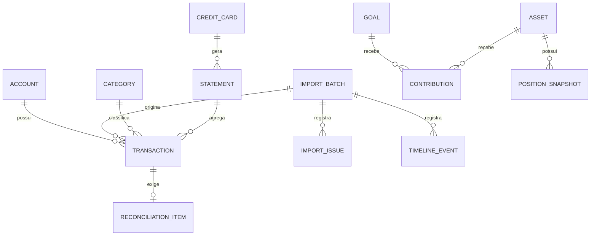
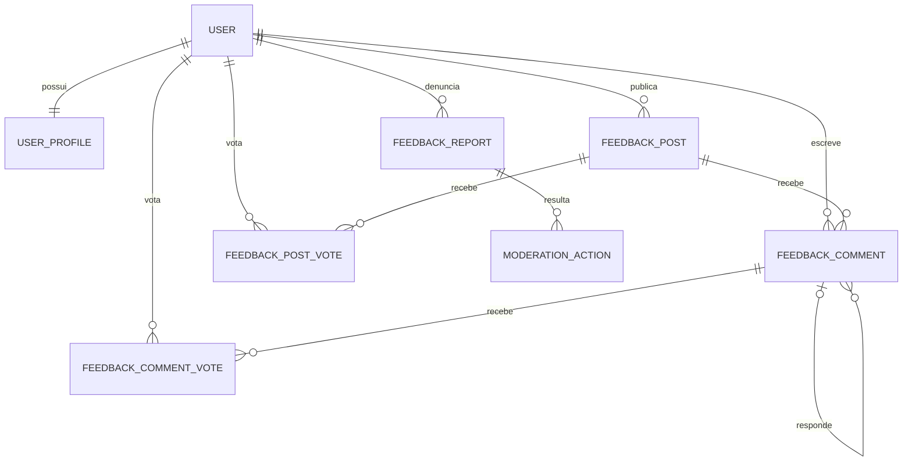

# Modelo de dados do Talentum

As regras operacionais obrigatórias para criar, consultar, migrar e escalar estas estruturas estão em [`ESTRUTURA_DE_DADOS.md`](./ESTRUTURA_DE_DADOS.md).

## Status

Modelo conceitual planejado. O `schema.prisma` atual implementa `LocalProfile`, `UserPreference`, `OnboardingSession`, `OnboardingAnswer`, o núcleo financeiro formado por `Institution`, `Account`, `BalanceSnapshot`, `Category`, `ImportBatch` e `Transaction`, a `ScheduledObligation` e os detalhes de importação `ImportFile`, `ImportIssue` e `CsvMappingProfile`. Os demais agregados deste documento ainda não foram implementados.

`OnboardingSession` mantém estado, etapa, versão e conclusão do primeiro acesso;
`OnboardingAnswer` guarda respostas simples relacionadas à sessão e ao perfil. A
unicidade `(onboardingSessionId, questionKey)` permite atualização idempotente,
e `version` aplica concorrência otimista. Dados financeiros consolidados
pertencem às tabelas tipadas do domínio, não a esse rascunho de interface.

`IncomeSource` registra entradas esperadas sem tratá-las como saldo disponível.
`MerchantRule` relaciona um padrão local a uma `Category` e possui prioridade,
tipo de comparação e estado. Ambos são atuais; `PixIdentifier` permanece na
frente de contas e segurança de identificadores próprios.

O schema evolui somente por migrations versionadas. `mvp_financial_core` cria o núcleo financeiro, `mvp_scheduled_obligations` cria as obrigações e `mvp_import_details` acrescenta os detalhes de importação; ambientes executam `prisma migrate deploy` e nunca dependem de alteração manual ou `db push` em produção.

### Detalhes de importação — atual

A migration `mvp_import_details` é **aditiva**: as colunas novas entram por
`ALTER TABLE ADD COLUMN` e nenhuma tabela já aplicada é reconstruída.

| Estrutura | Papel |
| --- | --- |
| `ImportBatch.periodStart`, `ImportBatch.periodEnd` | intervalo civil coberto pelo arquivo, não a data da importação |
| `ImportBatch.accountId` | conta de destino do lote |
| `ImportBatch.rowCount`, `importedCount`, `duplicateCount` | o que foi lido, o que foi gravado e o que já existia |
| `Transaction.externalId` | identificador do lançamento no banco de origem (`FITID` no OFX, coluna de identificação no CSV) |
| `ImportFile` | metadados do arquivo: nome sanitizado, tamanho, tipo, codificação e SHA-256 do texto normalizado |
| `ImportIssue` | linha que não pôde ser convertida, com motivo |
| `CsvMappingProfile` | mapeamento de colunas reutilizável por instituição |
| `BalanceSnapshot.importBatchId` | lote que gravou o saldo, quando ele veio de uma importação |

Invariantes acrescentadas:

1. `periodStart`/`periodEnd` resolvem a lacuna **L-2** de [`DASHBOARD.md`](./DASHBOARD.md): sem eles o sistema não distingue “mês sem movimento” de “mês sem extrato”, e o gráfico de entradas e saídas por mês não pode ser publicado com honestidade.
2. `(accountId, externalId)` é único. No SQLite `NULL` é distinto de `NULL`, então lançamentos sem identificador de origem continuam permitidos — para esses, a comparação usa dia civil, valor e descrição.
3. `ImportFile` guarda **metadados, nunca conteúdo**. O extrato é processado em memória e descartado; o `contentHash` é a mesma impressão digital do lote.
4. Uma linha ilegível vira `ImportIssue` e é declarada. Ela não é importada nem omitida em silêncio.
5. Lançamento vindo de extrato nasce com `status = 'posted'`: ele já aconteceu. `pending` continua reservado à fila de conciliação, que nasce na migration 6.
6. `BalanceSnapshot.importBatchId` identifica a origem do saldo. Desfazer uma importação apaga somente o saldo que ela gravou; um saldo informado à mão depois não tem lote e permanece. Sem esse vínculo, a reversão só conseguiria identificar o saldo por aproximação — pelo instante de criação — e destruiria dado da pessoa usuária.

O schema atual é criado pelas migrations `init`, `mvp_financial_core`, `mvp_scheduled_obligations`, `mvp_import_details` e `balance_snapshot_source`, nessa ordem.

### `ScheduledObligation` — atual

Compromisso com valor e vencimento. É o subtraendo do Saldo Livre de Risco.

| Campo | Papel |
| --- | --- |
| `id` | identificador opaco |
| `profileId`, `accountId?`, `categoryId?` | relações por chave estrangeira |
| `description` | rótulo local do compromisso |
| `amountCents` | `BigInt`, centavos inteiros |
| `dueDate` | vencimento; define se entra no período |
| `status` | `open`, `paid` ou `cancelled` |
| `recurrence` | `none`, `weekly`, `monthly` ou `yearly` |
| `isEstimated` | valor informado como aproximado |

Invariante: **somente `status = 'open'` é descontado**. Sem esse campo, uma obrigação já paga continuaria sendo subtraída e o Saldo Livre de Risco ficaria permanentemente pessimista. Índice principal em `(profileId, status, dueDate)`, derivado da consulta do painel.

No MVP, uma fatura de cartão aberta é representada como `ScheduledObligation`: `CreditCard` e `Statement` pertencem à Etapa 8 do roadmap.

## Princípios

- toda tabela, inclusive tabelas associativas, possui `id` opaco como chave primária;
- toda relação persistida usa uma chave estrangeira terminada em `Id`;
- IDs expostos são UUIDv7, ULID ou formato opaco equivalente; nunca sequência previsível;
- dados financeiros completos permanecem no SQLite local;
- valores monetários usam centavos inteiros ou `Decimal`, nunca `Float`;
- datas financeiras distinguem data civil, competência e instante técnico;
- importações e correções são rastreáveis;
- exclusões com impacto histórico devem ser recuperáveis quando possível;
- percentuais derivados são calculados, não persistidos sem justificativa.

## Agregados locais

| Agregado | Responsabilidade | Entidades principais |
| --- | --- | --- |
| Identidade local | Preferências e vínculo opcional com identidade remota | `LocalProfile`, `UserPreference` |
| Contas | Instituições, contas e saldos informados | `Institution`, `Account`, `BalanceSnapshot` |
| Importação | Arquivo, lote, parser e diagnóstico | `ImportBatch`, `ImportFile`, `ImportIssue` |
| Transações | Lançamentos normalizados e categorias | `Transaction`, `Category`, `MerchantRule` |
| Cartões | Cartões, faturas, benefícios e recorrências | `CreditCard`, `Statement`, `CardBenefit`, `RecurringCharge` |
| Conciliação | Pendências, decisões e ajustes | `ReconciliationItem`, `FinancialAdjustment` |
| Planejamento | Orçamento, metas e obrigações | `Budget`, `Goal`, `ScheduledObligation` |
| Patrimônio | Ativos, posições, pilares e aportes | `Asset`, `PositionSnapshot`, `Contribution` |
| Produto | Alertas, missões e histórico | `Notification`, `Mission`, `Achievement`, `TimelineEvent` |
| Backup | Execuções, versões e integridade | `BackupRecord` |

## Relações essenciais

## Invariantes

1. `ImportBatch.fingerprint` é único por perfil e impede duplicação acidental. Ele é calculado sobre o texto decodificado com quebras de linha normalizadas, de modo que o mesmo extrato reexportado com CRLF continue sendo reconhecido.
2. Toda transação importada referencia o lote de origem, e desfazer o lote remove exatamente o que ele criou.
3. Ajustes não sobrescrevem silenciosamente o valor original; preservam antes, depois e motivo.
4. Uma conciliação concluída registra autor, instante e decisão.
5. O total de uma posição nunca é inferido de percentuais armazenados.
6. Um aporte não pode ser negativo; retiradas usam evento próprio.
7. Eventos de timeline não armazenam segredos nem o conteúdo bruto do extrato.

## Dados remotos mínimos

| Dado | Finalidade | Conteúdo proibido |
| --- | --- | --- |
| Identificador de conta | autenticação | CPF e dados bancários |
| Identidade OAuth mínima | login | token em texto permanente |
| Metadados de backup | versão, checksum e localização | chave de decifragem |
| Preferência de comunicação | consentimento | transações e saldos |

Ranking ou gamificação social não deve revelar patrimônio, renda, gastos ou hábitos. A necessidade de sincronizar XP remotamente permanece em aberto.

## Tabelas cloud planejadas

Cada responsabilidade possui tabela própria. Campos comuns incluem `id`, `createdAt` e `updatedAt` quando aplicáveis.

O código efêmero de ação não é tabela permanente e não recebe ID relacional: é estado operacional temporário, armazenado somente como hash com TTL e apagado após consumo. Ele não integra histórico, auditoria ou analytics. Eventos de auditoria registram o resultado da ação com `AuditEvent.id`, nunca o código.

| Tabela | Chaves por ID | Finalidade |
| --- | --- | --- |
| `User` | `id` | conta interna e estado |
| `UserProfile` | `id`, `userId` | nome público e avatar aprovado |
| `OAuthIdentity` | `id`, `userId` | vínculo com emissor e subject |
| `AuthSession` | `id`, `userId` | sessão, expiração, revogação e risco |
| `RefreshTokenFamily` | `id`, `sessionId` | rotação e revogação |
| `RefreshToken` | `id`, `familyId` | hash, expiração, consumo e sucessor |
| `AuthTransaction` | `id` | `state`, `nonce` e PKCE temporários seguros |
| `Consent` | `id`, `userId` | versão e aceite de termos/privacidade |
| `Release` | `id` | versão, canal e estado |
| `ReleaseArtifact` | `id`, `releaseId` | plataforma, objeto, checksum e assinatura |
| `DownloadGrant` | `id`, `userId`, `artifactId` | concessão curta de download |
| `FeedbackPost` | `id`, `authorUserId` | sugestão pública e estado |
| `FeedbackComment` | `id`, `postId`, `authorUserId`, `parentCommentId?` | comentários e respostas |
| `FeedbackPostVote` | `id`, `postId`, `userId` | uma curtida por usuário/post |
| `FeedbackCommentVote` | `id`, `commentId`, `userId` | uma curtida por usuário/comentário |
| `FeedbackReport` | `id`, `reporterUserId`, `postId?`, `commentId?` | denúncia de um conteúdo |
| `ModerationAction` | `id`, `moderatorUserId`, `postId?`, `commentId?`, `reportId?` | decisão de moderação |
| `SecurityEvent` | `id`, `userId?`, `sessionId?` | autenticação/abuso sem segredo |
| `AuditEvent` | `id`, `actorUserId?` | trilha administrativa |

## Relações da comunidade

Restrições únicas: `(postId, userId)` em `FeedbackPostVote`, `(commentId, userId)` em `FeedbackCommentVote` e `(provider, providerSubject)` em `OAuthIdentity`. Uma denúncia referencia um post ou comentário, nunca ambos. Exclusão pública usa estado/tombstone para preservar relações e auditoria.

## Migrações

- cada alteração de schema deve incluir migração revisável;
- migrações destrutivas exigem backup local e caminho de recuperação;
- a aplicação deve registrar a versão do schema;
- fixtures e testes usam somente dados sintéticos;
- migração e restauração devem ser testadas em cópias, nunca no único banco do usuário.
