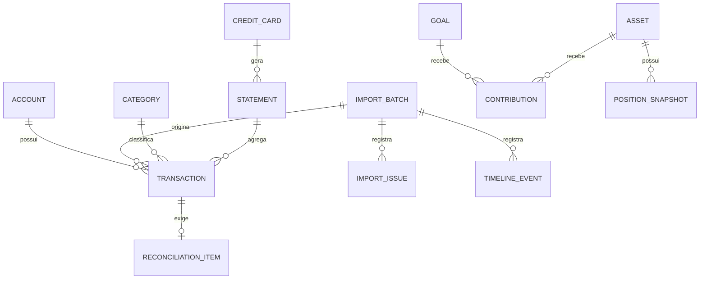
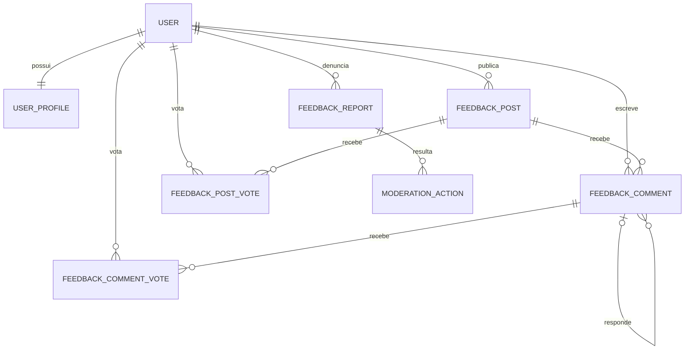

# Modelo de dados do Talentum

As regras operacionais obrigatórias para criar, consultar, migrar e escalar estas estruturas estão em [`ESTRUTURA_DE_DADOS.md`](./ESTRUTURA_DE_DADOS.md).

## Status

Modelo conceitual planejado. O `schema.prisma` atual implementa `LocalProfile`, `UserPreference` e o núcleo financeiro inicial formado por `Institution`, `Account`, `BalanceSnapshot`, `Category`, `ImportBatch` e `Transaction`. Os demais agregados deste documento ainda não foram implementados.

O schema evolui somente por migrations versionadas. A migration `mvp_financial_core` cria o núcleo financeiro; ambientes executam `prisma migrate deploy` e nunca dependem de alteração manual ou `db push` em produção.

## Princípios

- toda tabela, inclusive tabelas associativas, possui `id` opaco como chave primária;
- toda relação persistida usa uma chave estrangeira terminada em `Id`;
- IDs expostos são UUIDv7, ULID ou formato opaco equivalente; nunca sequência previsível;
- dados financeiros completos permanecem no SQLite local;
- valores monetários usam centavos inteiros ou `Decimal`, nunca `Float`;
- datas financeiras distinguem data civil, competência e instante técnico;
- importações e correções são rastreáveis;
- exclusões com impacto histórico devem ser recuperáveis quando possível;
- percentuais derivados são calculados, não persistidos sem justificativa.

## Agregados locais

| Agregado | Responsabilidade | Entidades principais |
| --- | --- | --- |
| Identidade local | Preferências e vínculo opcional com identidade remota | `LocalProfile`, `UserPreference` |
| Contas | Instituições, contas e saldos informados | `Institution`, `Account`, `BalanceSnapshot` |
| Importação | Arquivo, lote, parser e diagnóstico | `ImportBatch`, `ImportFile`, `ImportIssue` |
| Transações | Lançamentos normalizados e categorias | `Transaction`, `Category`, `MerchantRule` |
| Cartões | Cartões, faturas, benefícios e recorrências | `CreditCard`, `Statement`, `CardBenefit`, `RecurringCharge` |
| Conciliação | Pendências, decisões e ajustes | `ReconciliationItem`, `FinancialAdjustment` |
| Planejamento | Orçamento, metas e obrigações | `Budget`, `Goal`, `ScheduledObligation` |
| Patrimônio | Ativos, posições, pilares e aportes | `Asset`, `PositionSnapshot`, `Contribution` |
| Produto | Alertas, missões e histórico | `Notification`, `Mission`, `Achievement`, `TimelineEvent` |
| Backup | Execuções, versões e integridade | `BackupRecord` |

## Relações essenciais

## Invariantes

1. `ImportBatch.fingerprint` é único por perfil e impede duplicação acidental.
2. Toda transação importada referencia o lote de origem.
3. Ajustes não sobrescrevem silenciosamente o valor original; preservam antes, depois e motivo.
4. Uma conciliação concluída registra autor, instante e decisão.
5. O total de uma posição nunca é inferido de percentuais armazenados.
6. Um aporte não pode ser negativo; retiradas usam evento próprio.
7. Eventos de timeline não armazenam segredos nem o conteúdo bruto do extrato.

## Dados remotos mínimos

| Dado | Finalidade | Conteúdo proibido |
| --- | --- | --- |
| Identificador de conta | autenticação | CPF e dados bancários |
| Identidade OAuth mínima | login | token em texto permanente |
| Metadados de backup | versão, checksum e localização | chave de decifragem |
| Preferência de comunicação | consentimento | transações e saldos |

Ranking ou gamificação social não deve revelar patrimônio, renda, gastos ou hábitos. A necessidade de sincronizar XP remotamente permanece em aberto.

## Tabelas cloud planejadas

Cada responsabilidade possui tabela própria. Campos comuns incluem `id`, `createdAt` e `updatedAt` quando aplicáveis.

O código efêmero de ação não é tabela permanente e não recebe ID relacional: é estado operacional temporário, armazenado somente como hash com TTL e apagado após consumo. Ele não integra histórico, auditoria ou analytics. Eventos de auditoria registram o resultado da ação com `AuditEvent.id`, nunca o código.

| Tabela | Chaves por ID | Finalidade |
| --- | --- | --- |
| `User` | `id` | conta interna e estado |
| `UserProfile` | `id`, `userId` | nome público e avatar aprovado |
| `OAuthIdentity` | `id`, `userId` | vínculo com emissor e subject |
| `AuthSession` | `id`, `userId` | sessão, expiração, revogação e risco |
| `RefreshTokenFamily` | `id`, `sessionId` | rotação e revogação |
| `RefreshToken` | `id`, `familyId` | hash, expiração, consumo e sucessor |
| `AuthTransaction` | `id` | `state`, `nonce` e PKCE temporários seguros |
| `Consent` | `id`, `userId` | versão e aceite de termos/privacidade |
| `Release` | `id` | versão, canal e estado |
| `ReleaseArtifact` | `id`, `releaseId` | plataforma, objeto, checksum e assinatura |
| `DownloadGrant` | `id`, `userId`, `artifactId` | concessão curta de download |
| `FeedbackPost` | `id`, `authorUserId` | sugestão pública e estado |
| `FeedbackComment` | `id`, `postId`, `authorUserId`, `parentCommentId?` | comentários e respostas |
| `FeedbackPostVote` | `id`, `postId`, `userId` | uma curtida por usuário/post |
| `FeedbackCommentVote` | `id`, `commentId`, `userId` | uma curtida por usuário/comentário |
| `FeedbackReport` | `id`, `reporterUserId`, `postId?`, `commentId?` | denúncia de um conteúdo |
| `ModerationAction` | `id`, `moderatorUserId`, `postId?`, `commentId?`, `reportId?` | decisão de moderação |
| `SecurityEvent` | `id`, `userId?`, `sessionId?` | autenticação/abuso sem segredo |
| `AuditEvent` | `id`, `actorUserId?` | trilha administrativa |

## Relações da comunidade

Restrições únicas: `(postId, userId)` em `FeedbackPostVote`, `(commentId, userId)` em `FeedbackCommentVote` e `(provider, providerSubject)` em `OAuthIdentity`. Uma denúncia referencia um post ou comentário, nunca ambos. Exclusão pública usa estado/tombstone para preservar relações e auditoria.

## Migrações

- cada alteração de schema deve incluir migração revisável;
- migrações destrutivas exigem backup local e caminho de recuperação;
- a aplicação deve registrar a versão do schema;
- fixtures e testes usam somente dados sintéticos;
- migração e restauração devem ser testadas em cópias, nunca no único banco do usuário.
