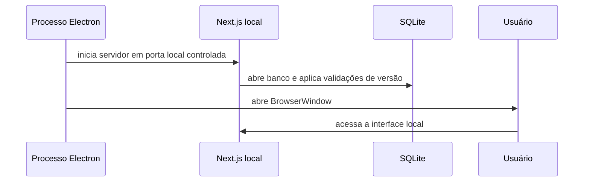
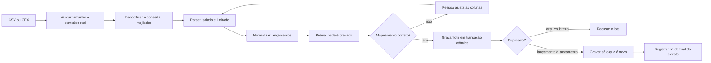
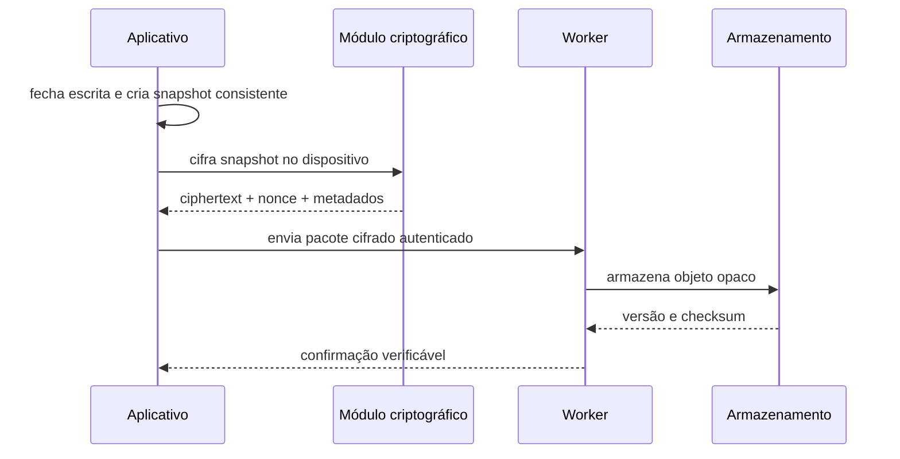

# Como o Talentum funciona

## Protocolo de toda ação do frontend

1. O frontend informa ao backend o método e contrato que pretende chamar.
2. O backend retorna um código opaco, aleatório e válido por no máximo 60 segundos.
3. O frontend envia a requisição real com `X-Action-Code`.
4. O backend valida e consome o código atomicamente, depois autentica, autoriza, limita e valida a ação.
5. O código é descartado e nunca entra em histórico ou analytics.

A rota que emite códigos é a única exceção. O código não substitui access token, refresh token, CSRF ou idempotência.

## Web: cadastro e downloads

1. A LP pública solicita ao backend o início do login.
2. O backend conduz OAuth/OIDC com Authorization Code e PKCE.
3. Após validar callback, identidade e consentimentos, o backend cria a sessão.
4. A página protegida solicita releases ao backend.
5. O backend autoriza o usuário e retorna opções para Windows e Linux.
6. O backend registra uma concessão curta por ID e retorna o instalador assinado publicado em GitHub Releases; o D1 armazena somente metadados.

## Comunidade de feedback

1. A aba consulta posts publicados no backend Cloudflare com paginação por cursor.
2. Usuário autenticado envia post, comentário, voto ou denúncia para uma rota documentada.
3. O backend valida sessão, schema, propriedade, rate limit, antispam e estado do conteúdo.
4. A ação é persistida em tabela própria, relacionada por IDs, e gera auditoria quando necessário.
5. A resposta contém somente conteúdo público e perfil público mínimo.
6. Moderação pode ocultar conteúdo sem destruir a trilha de relações e decisões.

## Estado atual

`pnpm dev` encerra um processo anterior na porta 3000, aguarda a liberação, remove `.next` e inicia o Next.js em `http://127.0.0.1:3000`. `pnpm dev:all` aguarda uma resposta HTTP válida, abre essa URL no Electron e encerra os dois processos em conjunto.

Estão implementados e verificáveis: o painel, a importação de extrato em CSV e OFX, a listagem de lançamentos, o cadastro de perfil, instituições e contas, e a reversão de lote. Continuam sendo telas vazias à espera de implementação: cartões, conciliação, patrimônio, metas, notícias, histórico e gamificação — elas não exibem dado fictício, apenas o estado vazio.

## Inicialização planejada

Em produção, o processo deve escolher uma porta disponível ou usar um canal local autenticado. A API local não deve ficar exposta para a rede externa.

## Importação e conciliação

O fluxo tem dois passos, e só o segundo escreve. **CSV e OFX estão
implementados**; PDF é a Etapa 7 do [`ROADMAP.md`](./ROADMAP.md).

Requisitos, todos atendidos pelo importador atual:

- reconhecer o formato pelo **conteúdo**, nunca pela extensão ou pelo tipo declarado;
- calcular uma impressão digital do arquivo para evitar importação duplicada;
- deduplicar também por lançamento, para que extratos com período sobreposto não gravem o mesmo lançamento duas vezes;
- executar a persistência em transação atômica;
- manter rastreabilidade entre arquivo, lote e lançamentos;
- declarar toda linha ilegível em vez de omiti-la;
- registrar o intervalo coberto pelo arquivo, e não apenas a data da importação;
- permitir desfazer o lote sem afetar alterações posteriores não relacionadas — inclusive preservando um saldo informado à mão depois da importação, o que exige que o saldo gravado pelo lote seja identificável, e não inferido pelo instante de criação;
- não reter o conteúdo do extrato: apenas lançamentos e metadados do arquivo;
- nunca enviar o extrato para serviços de IA externos.

A classificação automática por regras e a fila de conciliação pertencem ao
MVP 5. Hoje o lançamento importado entra como `posted` e **sem categoria** — ele
aparece no painel na fatia "Sem categoria", que funciona como o convite à
conciliação até que `ReconciliationItem` exista.

## Saldo Livre de Risco

O cálculo parte dos saldos confirmados e desconta obrigações previstas dentro do período: faturas abertas, contas recorrentes e débitos automáticos. Entradas futuras incertas não devem aumentar o saldo livre. A fórmula e os critérios de inclusão precisam de testes com datas-limite, cancelamentos, pagamentos parciais e duplicidades.

## Patrimônio e aportes

Cada ativo é associado a um dos quatro pilares: Ações, Real Estate, Caixa ou Ativos Internacionais. O sistema calcula a participação de cada pilar sobre o patrimônio considerado e usa a faixa de 22,5% a 27,5% como banda de equilíbrio.

Uma sugestão de aporte:

1. verifica se o modo de sobrevivência está ativo;
2. calcula o total elegível da carteira;
3. identifica pilares abaixo da banda;
4. simula a distribuição do novo aporte;
5. explica o cálculo, sem apresentar a saída como recomendação financeira individual.

## Notícias e resumos

O Worker busca apenas fontes permitidas, normaliza metadados e devolve links para o conteúdo original. O resumo recebe o texto público da notícia, não a carteira completa nem dados financeiros do usuário. Falhas de IA devem manter título, fonte e link disponíveis.

## Backup e restauração

A restauração baixa o objeto cifrado, valida integridade, decifra localmente em destino temporário, valida o banco e só então substitui a base ativa de forma recuperável.

## Histórico

Eventos relevantes são registrados com tipo, instante, entidade relacionada e metadados mínimos. O histórico é uma trilha de produto e suporte ao desfazer; não deve conter tokens, conteúdo bruto de documentos ou dados desnecessários.
