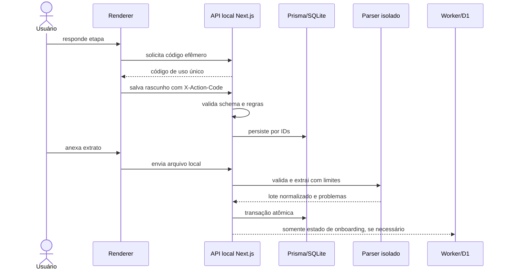

# Onboarding e fotografia financeira inicial

## Status

Documento normativo para o onboarding financeiro. O fluxo permanece planejado até que suas rotas, tabelas e telas sejam implementadas e testadas.

## Problema

Uma pessoa nova precisa representar com fidelidade sua situação atual mesmo sem possuir histórico completo. O onboarding deve criar uma **fotografia financeira com data-base**, registrar a origem e a confiança de cada valor e importar pelo menos o extrato que a pessoa conseguir obter.

Não devemos fingir que um extrato parcial representa todo o passado. O sistema separa:

- posição atual declarada ou confirmada;
- histórico realmente importado;
- valores inferidos;
- períodos sem cobertura de dados.

## Resultado mínimo esperado

Ao terminar, o sistema consegue responder:

1. quanto entra mensalmente e com que regularidade;
2. quais instituições, contas e cartões existem;
3. qual é o saldo atual em cada conta;
4. quais contas, faturas, parcelas e dívidas ainda consumirão o saldo;
5. quanto existe em investimentos e em qual instituição;
6. quais posições de ativos existem, com quantidade, preço médio e valor de referência;
7. qual período está coberto pelos extratos anexados;
8. qual é o nível de confiança da fotografia inicial.

## Mensagem obrigatória de privacidade

Antes da primeira pergunta financeira, mostrar em linguagem simples:

> Seus dados financeiros ficam salvos somente neste dispositivo. Salários, bancos, saldos, contas, chaves PIX, extratos, transações, dívidas e investimentos não são enviados ao Talentum, à Vercel nem ao Cloudflare D1. Eles são processados localmente para montar seu planejamento. Você poderá revisar, corrigir, exportar e apagar esses dados.

Complementos na interface:

- link “Como protegemos seus dados” com explicação curta e verificável;
- indicação **Salvo somente neste dispositivo** nas etapas financeiras;
- aviso específico antes de anexar arquivo: **Seu extrato será processado localmente e não será enviado à nuvem**;
- consentimento não deve usar caixa previamente marcada;
- não prometer proteção absoluta: acesso indevido ao próprio dispositivo continua sendo um risco;
- explicar que login, sessão e estado técnico da conta são dados separados mantidos no backend, sem valores financeiros.

## Mapa completo de perguntas

As perguntas abaixo representam o catálogo. A interface deve apresentá-las progressivamente, ocultando perguntas condicionais que não se aplicam.

### Bloco 0 — Privacidade e início

| Pergunta | Tipo | Finalidade | Destino |
| --- | --- | --- | --- |
| “Entendeu que os dados financeiros ficam somente neste dispositivo?” | obrigatória | confirmar ciência do modelo local-first | local; cloud recebe no máximo versão do aviso aceita, sem dado financeiro |
| “Deseja configurar sua fotografia financeira agora?” | obrigatória | iniciar ou adiar com estado parcial | local |
| “Qual moeda você usa principalmente?” | obrigatória | interpretar valores corretamente | local |
| “Qual é a data de referência dos valores informados?” | obrigatória, padrão hoje | manter a fotografia temporalmente correta | local |

### Bloco 1 — Renda

Pergunta inicial: **“Você possui alguma renda recorrente?”**

Se sim, repetir para cada fonte:

| Pergunta | Tipo | Observação |
| --- | --- | --- |
| “Qual é o nome ou apelido desta renda?” | obrigatória | exemplo: salário, aposentadoria, prestação de serviço |
| “Qual valor líquido costuma receber?” | obrigatória para projeção | aceitar aproximado e marcar como estimativa |
| “Com que frequência recebe?” | obrigatória | mensal, quinzenal, semanal, anual, variável ou outra |
| “Em qual dia ou faixa costuma receber?” | opcional para renda variável | nunca tratar como garantia |
| “Em qual conta costuma entrar?” | opcional até cadastrar contas | relacionar depois por `accountId` |
| “Esse valor é fixo ou varia?” | obrigatória | muda a forma de projetar |
| “Deseja adicionar outra fonte de renda?” | condicional | múltiplas fontes |

Não perguntar empregador, profissão, CNPJ do pagador ou documento sem necessidade aprovada.

### Bloco 2 — Instituições e contas

Pergunta inicial: **“Onde você mantém dinheiro ou movimenta pagamentos?”**

Para cada conta:

| Pergunta | Tipo | Observação |
| --- | --- | --- |
| “Qual é a instituição?” | obrigatória | lista pesquisável + “Outra” |
| “Que tipo de conta é?” | obrigatória | corrente, pagamento, poupança, corretora, carteira ou dinheiro |
| “Como deseja identificar esta conta?” | opcional | apelido local, como “Conta principal” |
| “Qual é o saldo atual?” | obrigatória | permitir negativo e “valor aproximado” |
| “Quando este saldo foi consultado?” | obrigatória, padrão agora | data/hora de referência |
| “O saldo veio do banco ou foi estimado?” | obrigatória | `BANK_REPORTED` ou `USER_DECLARED` |
| “Esta conta recebe alguma renda cadastrada?” | condicional | vínculo por IDs |
| “Esta conta paga despesas recorrentes?” | opcional | ajuda a ordenar o próximo bloco |
| “Esta conta também é usada para investimentos?” | obrigatória | abre bloco de investimentos para essa conta |
| “Deseja adicionar outra conta?” | condicional | suporta vários bancos |

Não perguntar agência, número de conta, senha ou credencial bancária.

### Bloco 3 — Chaves PIX próprias

Pergunta por conta: **“Deseja cadastrar uma chave PIX desta conta para identificarmos transferências entre suas próprias contas?”**

Se sim:

| Pergunta | Tipo | Observação |
| --- | --- | --- |
| “Qual é o tipo da chave?” | obrigatória | CPF, CNPJ, telefone, e-mail ou aleatória |
| “Qual é a chave?” | obrigatória | mascarar na interface após salvar |
| “Esta chave está ativa atualmente?” | obrigatória | ativa ou histórica/inativa |
| “Desde quando ou até quando ela foi usada?” | opcional | ajuda extratos antigos |
| “Deseja adicionar outra chave desta conta?” | condicional | várias chaves por conta |

Antes do campo, repetir: **A chave será cifrada e salva somente neste dispositivo.**

### Bloco 4 — Cartões e faturas

Pergunta inicial: **“Você possui cartão de crédito com fatura aberta ou compras parceladas?”**

Para cada cartão:

| Pergunta | Tipo | Observação |
| --- | --- | --- |
| “Qual instituição emitiu o cartão?” | obrigatória | reutilizar instituição existente |
| “Qual apelido deseja usar?” | opcional | nunca pedir número completo |
| “Quais são os quatro últimos dígitos?” | opcional | somente para diferenciar cartões |
| “Qual é o dia de fechamento?” | opcional no início | melhora projeção |
| “Qual é o dia de vencimento?” | obrigatória | necessário para saldo livre |
| “Qual é o valor atual da fatura?” | obrigatória quando conhecido | aceitar estimativa e data |
| “De qual conta a fatura é paga?” | opcional | vínculo por `accountId` |
| “Há compras parceladas futuras?” | condicional | valor/parcela e quantidade restante |

### Bloco 5 — Contas, compromissos e dívidas

Pergunta inicial: **“Quais valores ainda precisam ser pagos?”**

Para cada compromisso:

- nome/apelido;
- valor ou estimativa;
- vencimento;
- recorrência;
- categoria;
- conta de pagamento opcional;
- débito automático sim/não/não sei;
- número de parcelas restantes, se houver.

Pergunta separada: **“Você possui dívida com juros ou pagamento atrasado?”** Caso sim, pedir somente saldo aproximado, parcela, vencimento e taxa/custo quando souber. Não pedir contrato, documento ou credencial.

### Bloco 6 — Reserva e valores comprometidos

| Pergunta | Tipo | Finalidade |
| --- | --- | --- |
| “Alguma parte dos saldos já está reservada e não pode ser usada?” | obrigatória | não inflar o saldo livre |
| “Quanto está reservado?” | condicional | registrar por conta/meta |
| “Para qual finalidade?” | condicional | reserva de emergência, imposto, viagem ou outra |
| “Esse valor está em alguma conta já cadastrada?” | condicional | evitar dupla contagem |

### Bloco 7 — Investimentos

Pergunta inicial: **“Você possui investimentos atualmente?”**

Para cada conta marcada como investimento:

| Pergunta | Tipo | Observação |
| --- | --- | --- |
| “Em qual instituição está o investimento?” | preenchida | relação com conta existente |
| “Qual é o ativo ou fundo?” | obrigatória | busca local + entrada manual |
| “Existe ticker/código?” | opcional | ativo pode não ter ticker |
| “Qual é a classe?” | obrigatória | ação, FII, renda fixa, caixa, internacional, cripto ou outra |
| “Qual quantidade possui?” | opcional quando só conhece o total | usar Decimal |
| “Qual foi o preço médio?” | opcional | nunca bloquear por ausência |
| “Qual é o valor atual aproximado?” | obrigatório para fotografia | não confundir com custo |
| “Quando esse valor foi consultado?” | obrigatória | mostrar defasagem |
| “Em qual moeda está avaliado?” | obrigatória | sem conversão silenciosa |
| “Deseja adicionar outro ativo?” | condicional | entrada em lote |

Para renda fixa, adaptar perguntas para valor aplicado, valor atual, vencimento, liquidez e indexador opcional. Não forçar quantidade/preço médio onde esses conceitos não se aplicam.

### Bloco 8 — Extratos disponíveis

Perguntas:

1. “De quais contas você consegue anexar extrato agora?”
2. “Qual formato possui?” — OFX no MVP; PDF posteriormente.
3. “Qual período acredita que o arquivo cobre?” — opcional, pois o parser deve conferir.
4. “Deseja anexar outro extrato?”
5. “Podemos descartar o arquivo original após confirmar a importação?” — decisão de retenção explícita.

O sistema detecta instituição, conta, período, moeda, saldo quando disponível e duplicidade. Toda detecção precisa ser confirmável; não pedir novamente dado idêntico já comprovado pelo arquivo.

### Bloco 9 — Revisão da fotografia inicial

Perguntas de confirmação:

- “Estas são todas as contas que deseja considerar agora?”
- “Os saldos exibidos correspondem aproximadamente ao que você possui hoje?”
- “As faturas, dívidas e contas mais próximas estão representadas?”
- “Os investimentos não foram contados duas vezes dentro do saldo da conta?”
- “Deseja corrigir alguma divergência encontrada?”
- “Confirma esta fotografia financeira na data indicada?”

Depois da confirmação, mostrar claramente:

- valores confirmados;
- valores aproximados;
- valores inferidos;
- contas sem extrato;
- período de histórico conhecido;
- pendências que afetam a confiança.

## Obrigatório versus adiável

### Necessário para um dashboard inicial confiável

- moeda e data-base;
- pelo menos uma conta/instituição;
- saldo atual e data de cada conta incluída;
- rendas recorrentes existentes ou confirmação de que não existem;
- obrigações/faturas próximas ou confirmação de que não existem;
- valores reservados ou confirmação de que não existem;
- revisão final.

### Necessário para concluir o onboarding completo

- ao menos um extrato importado, se mantivermos a decisão de obrigatoriedade;
- contas relevantes cadastradas;
- investimentos existentes representados ao menos pelo valor atual;
- divergências críticas revisadas.

### Pode ficar para depois

- preço médio;
- ticker;
- datas históricas de chave PIX;
- fechamento do cartão;
- taxa exata de dívida;
- detalhes de indexador e rentabilidade;
- categorias personalizadas;
- metas e metodologia ARCA.

## Perguntas que não devem existir

- senha ou token bancário;
- código de autenticação/OTP;
- número completo do cartão e CVV;
- agência e número de conta sem caso indispensável;
- CPF, endereço ou empregador para “completar cadastro”;
- chave privada, seed phrase ou senha de corretora/cripto;
- permissão para enviar extrato ou dados financeiros à nuvem;
- perguntas de marketing misturadas às etapas obrigatórias.

## Fluxo rápido proposto

### Etapa 1 — Contexto essencial

- moeda e data-base;
- renda mensal líquida aproximada;
- frequência: mensal, quinzenal, variável ou sem renda recorrente;
- dia ou faixa de recebimento;
- opção “prefiro informar depois” para campos não indispensáveis.

Não pedir profissão, empregador, CPF, endereço ou renda bruta sem um caso de uso aprovado.

### Etapa 2 — Instituições e contas

Interface de repetição rápida: selecionar instituição, escolher o tipo da conta e informar o saldo atual. Botão “Adicionar outra conta” permite múltiplos bancos.

Para cada conta:

- instituição;
- tipo: corrente, pagamento, poupança, corretora, carteira ou dinheiro;
- apelido opcional;
- saldo atual;
- data/hora do saldo;
- origem: banco, usuário ou importação;
- conta principal para entradas/saídas, sem obrigar uma única conta.

Não solicitar agência, número da conta, senha, código de acesso ou credencial bancária. Para reconhecer movimentações entre contas do próprio usuário, permitir cadastrar uma ou mais chaves PIX vinculadas a cada conta.

### Chaves PIX e transferências próprias

Uma chave PIX pode ser CPF, CNPJ, telefone, e-mail ou chave aleatória. Mesmo sem agência/conta, esses valores são dados pessoais e alguns são identificadores fortes. Devem permanecer somente no dispositivo.

Para cada chave:

- tipo da chave;
- conta local proprietária por `accountId`;
- apelido seguro para exibição;
- valor normalizado cifrado localmente;
- HMAC do valor normalizado para busca/comparação;
- últimos caracteres mascarados, quando for seguro exibir;
- estado ativo/inativo e período de validade conhecido;
- origem: declarada pelo usuário ou detectada no extrato e confirmada.

O sistema não deve guardar a chave em texto puro em logs, timeline, analytics, D1 ou mensagens de erro. Um hash simples não basta para CPF, telefone e e-mail, pois o espaço de valores é previsível; usar HMAC com chave secreta do dispositivo para o índice de igualdade e criptografia autenticada para eventual recuperação/exibição.

Ao importar uma transação PIX, o backend local normaliza a chave encontrada e compara o HMAC com as chaves próprias cadastradas. Se origem e destino pertencerem ao perfil:

- classificar como `OWN_ACCOUNT_TRANSFER`;
- relacionar os dois lançamentos por um `TransferPair.id` quando ambos existirem;
- não contabilizar como receita, despesa ou economia;
- preservar taxas reais como lançamento separado;
- pedir confirmação quando houver somente um lado, chave incompleta ou baixa confiança.

Nome do favorecido, descrição, valor e proximidade de horário podem ajudar na conciliação, mas não confirmam sozinhos uma transferência própria. A chave PIX exata confirmada é o sinal principal.

### Etapa 3 — Compromissos imediatos

- cartões e faturas abertas;
- contas recorrentes e vencimentos;
- parcelas e dívidas;
- valores já reservados que não estão livres para gastar.

Esta etapa é indispensável para não apresentar o saldo bancário como Saldo Livre de Risco.

### Etapa 4 — Investimentos

Primeiro selecionar qual instituição/conta é usada para investir. Depois adicionar posições em uma grade rápida.

Por posição:

- ativo/fundo e ticker quando existir;
- classe e moeda;
- quantidade;
- preço médio, opcional quando desconhecido;
- valor atual declarado;
- data de referência;
- origem e confiança.

Preço médio não deve bloquear o onboarding: ele é útil para custo/resultado, mas o valor atual é suficiente para a fotografia patrimonial. Não buscar cotação externa no MVP sem fonte, licença e regra de atualização aprovadas.

### Etapa 5 — Importar extrato

- explicar que o arquivo é processado localmente e não vai para a nuvem;
- aceitar inicialmente OFX; PDF entra na etapa própria do roadmap;
- permitir múltiplos arquivos e informar quais períodos foram detectados;
- mostrar progresso, duplicidades e linhas que precisam de revisão;
- não confiar em extensão, MIME ou nome do arquivo;
- nunca executar conteúdo incorporado.

Decisão para discussão: exigir ao menos um extrato para marcar o onboarding como `COMPLETED`, mas permitir `PARTIAL` quando o usuário não consegue obtê-lo naquele momento. Bloquear todo o aplicativo tende a aumentar abandono e não melhora a fidelidade; o dashboard parcial pode exibir claramente “dados ainda não conferidos”.

### Etapa 6 — Revisão e conciliação inicial

Mostrar uma tela única com:

- total em contas;
- obrigações abertas;
- patrimônio investido;
- cobertura do histórico por conta;
- divergências entre saldo declarado e saldo inferido;
- campos ausentes que reduzem confiança.

O usuário pode voltar, corrigir e confirmar. A consolidação cria snapshots; não sobrescreve silenciosamente valores originais.

## Arquitetura proposta

### Fronteiras

- renderer nunca chama Prisma, filesystem ou parser diretamente;
- cada ação usa API local e código efêmero;
- arquivo e finanças permanecem no dispositivo;
- D1 não recebe salário, saldos, bancos, ativos, preço médio ou extratos;
- cloud pode receber somente `onboardingStatus`, versão e instante, se houver necessidade real;
- rascunhos são locais e recuperáveis após fechar o aplicativo.

## Modelo local candidato

Todas as tabelas possuem `id`; relações usam IDs.

| Tabela | Relações principais | Papel |
| --- | --- | --- |
| `OnboardingSession` | `profileId` | estado, etapa atual, versão e data-base |
| `OnboardingStepState` | `sessionId` | progresso/validação de cada etapa |
| `FinancialBaseline` | `profileId`, `sessionId` | fotografia consolidada e confiança |
| `IncomeSource` | `profileId`, `accountId?` | renda, frequência e faixa de data |
| `Institution` | — | instituição cadastrada localmente |
| `Account` | `profileId`, `institutionId` | conta, carteira ou corretora |
| `PixKey` | `accountId` | chave própria cifrada, índice HMAC, tipo e validade |
| `BalanceSnapshot` | `accountId`, `baselineId?` | saldo, data, origem e confiança |
| `CreditCard` | `profileId`, `institutionId`, `paymentAccountId?` | cartão e vencimentos |
| `Statement` | `creditCardId` | fatura aberta/fechada |
| `RecurringObligation` | `profileId`, `accountId?` | conta recorrente ou parcela |
| `Liability` | `profileId`, `institutionId?` | dívida, saldo e custo informado |
| `Asset` | — | identidade local do ativo/fundo |
| `Holding` | `accountId`, `assetId` | posição mantida na conta de investimento |
| `PositionSnapshot` | `holdingId`, `baselineId?` | quantidade, preço médio, valor e data |
| `ImportBatch` | `profileId`, `accountId?`, `sessionId?` | lote e fingerprint |
| `ImportFile` | `batchId` | arquivo temporário, tipo e hash |
| `ImportIssue` | `batchId`, `transactionId?` | divergência ou aviso |
| `Transaction` | `accountId`, `batchId?`, `categoryId?` | lançamento normalizado |
| `TransferPair` | `sourceTransactionId`, `destinationTransactionId?` | pareamento de transferência entre contas próprias |

Evitar uma tabela genérica de respostas como fonte financeira final. Ela facilita protótipo, mas perde tipos, constraints e relações. Estados de UI podem ser flexíveis; dados consolidados devem entrar em tabelas de domínio.

## Eficiência e redução de abandono

- uma decisão principal por tela, com estimativa de progresso;
- salvar automaticamente sem botão em cada campo, mas confirmar a consolidação final;
- reutilizar instituição e conta já informadas, evitando entrada redundante;
- aceitar valores aproximados e marcar precisão/origem;
- oferecer “não sei” para preço médio, frequência ou datas não essenciais;
- importar primeiro e pré-preencher o que o OFX consegue provar;
- permitir adicionar contas/ativos em lote com teclado;
- perguntar detalhes apenas quando alteram o Saldo Livre de Risco;
- mostrar benefício imediato após cada etapa, não uma sequência abstrata;
- permitir retomar exatamente da etapa interrompida.

Uma alternativa ainda mais rápida é começar pelo extrato OFX, detectar instituição/conta/saldo e depois perguntar somente o que não foi possível extrair. Devemos testar as duas ordens:

1. **Fotografia primeiro:** mais previsível, porém mais manual.
2. **Importação primeiro:** menos digitação, porém depende da qualidade do arquivo.

Recomendação inicial: perguntar moeda/data-base, oferecer importação primeiro e usar o formulário como complementação inteligente.

## Brechas e falhas possíveis

| Risco | Consequência | Mitigação candidata |
| --- | --- | --- |
| formulário longo | abandono | progressivo, rascunho, importação primeiro e “não sei” |
| salário obrigatório | dado excessivo/inexato | faixa ou valor líquido aproximado; explicar finalidade |
| saldo duplicado | patrimônio inflado | IDs, conta única por contexto e revisão consolidada |
| extratos sobrepostos | transações duplicadas | fingerprint de arquivo e chave estável de lançamento |
| saldo declarado diverge | dashboard falso | conciliação, origem, data-base e confiança |
| cotação desatualizada | patrimônio incorreto | data de referência visível; não fingir tempo real |
| preço médio ausente | bloqueio desnecessário | campo opcional e pendência explícita |
| arquivo malicioso | execução, DoS ou leitura indevida | allowlist, assinatura/conteúdo, limite, timeout e parser isolado |
| path traversal/nome hostil | sobrescrita/leitura local | ignorar nome original; ID interno e diretório fora do webroot |
| renderer comprometido | leitura de finanças | API local autenticada, sandbox, CSP e payload mínimo |
| log detalhado | vazamento de finanças | redigir valores, nomes e conteúdo; usar IDs técnicos |
| envio acidental à cloud | quebra local-first | contratos separados e testes que bloqueiam campos proibidos |
| chave PIX exposta | fraude, phishing e identificação | cifrar localmente, indexar por HMAC e proibir logs/cloud |
| hash previsível de CPF/telefone | reidentificação por força bruta | HMAC com chave protegida do dispositivo, não hash simples |
| falso pareamento de PIX | receita/despesa omitida | exigir chave própria confirmada ou revisão por baixa confiança |
| exclusão durante onboarding | perda de trabalho | transações, rascunho recuperável e confirmação/reversão |
| código efêmero tratado como segurança única | bypass | manter autenticação, autorização, CSRF, rate limit e validação |

## Validações financeiras

- dinheiro em centavos/Decimal, nunca `Float`;
- moeda explícita por conta/posição;
- data civil separada de instante técnico;
- permitir saldo negativo;
- renda variável não deve virar compromisso mensal garantido;
- ativo pode existir sem ticker e sem preço médio;
- quantidade e preço médio não podem produzir silenciosamente um “valor atual” sem data/fonte;
- totais derivados não são persistidos sem justificativa;
- toda inferência aparece como inferida e pode ser corrigida.

## Acessibilidade e prevenção de erro

- rótulos persistentes, ajuda contextual e mensagens ligadas ao campo;
- teclado completo, foco previsível e anúncio de progresso/erro;
- máscara visual não altera o valor sem confirmação;
- resumo revisável antes de consolidar dados financeiros;
- ações destrutivas podem ser canceladas ou revertidas;
- não pedir novamente informação já fornecida na mesma sessão.

## Métricas locais de qualidade

Sem analytics identificável, medir localmente e mostrar ao usuário:

- percentual de contas com saldo atualizado;
- cobertura temporal por conta;
- transações pendentes de conciliação;
- obrigações sem vencimento/valor;
- posições sem data ou valor atual;
- confiança geral: baixa, média ou alta, com explicação.

Não criar pontuação opaca. A confiança é derivada de critérios documentados.

## Decisões ainda em aberto

1. O extrato será obrigatório para concluir ou apenas fortemente recomendado?
2. Começamos por importar OFX ou por cadastrar contas/saldos?
3. Salário será valor exato, faixa ou ambos? Será sempre opcional?
4. Devemos pedir cartões/dívidas no primeiro fluxo ou logo depois do primeiro dashboard?
5. Preço médio ausente gera apenas aviso ou pendência obrigatória?
6. O original OFX é descartado após confirmar a importação ou mantido localmente?
7. O estado de conclusão do onboarding precisa realmente ir ao D1?
8. A primeira versão aceita múltiplas moedas?
9. A chave PIX será digitada, detectada no OFX e confirmada, ou ambos?
10. O usuário poderá cadastrar chave antiga/inativa para reconhecer o histórico?

## Critérios para promover esta proposta a oficial

- decidir as oito perguntas acima;
- prototipar os dois fluxos e medir tempo/erros com dados sintéticos;
- atualizar arquitetura Electron, API, modelo de dados, segurança, fluxos e roadmap;
- criar threat model específico de importação/onboarding;
- definir schemas REST e testes de contrato;
- garantir migração, reversão e exclusão dos rascunhos.

## Referências usadas na discussão

- OWASP File Upload Cheat Sheet: defesa em profundidade, allowlist, tipo real, assinatura, nome seguro, limites, armazenamento fora do webroot e parser atualizado.
- WCAG 2.2, 3.3.4: revisão, correção ou reversão para dados importantes.
- WCAG 2.2, 3.3.7: evitar pedir novamente informações já fornecidas.
