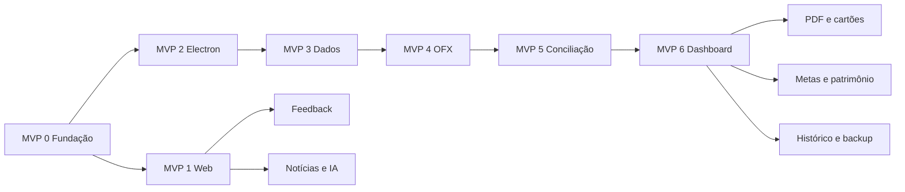

# Roadmap do Talentum

## Status e finalidade

Este roadmap é a fonte de verdade para a ordem de entrega planejada. Ele foi consolidado a partir do código atual e de toda a documentação do projeto em 2026-09-05. Datas não são prometidas enquanto não houver capacidade e estimativas validadas.

Estados:

- **Atual:** verificável no repositório.
- **MVP:** necessário para provar o valor central e produzir o primeiro release utilizável.
- **Próxima etapa:** macrofeature posterior ao MVP.
- **Em aberto:** depende de ADR, pesquisa ou validação.

## Estado atual — pré-alpha

Existe hoje:

- shell Electron mínimo;
- scripts de desenvolvimento que esperam um servidor Next.js na porta 3000;
- dependências-base e documentação técnica/produto;
- identidade visual em SVG.

Ainda não existe aplicação Next.js, frontend funcional, backend, schema Prisma, banco, testes de produto, Worker, D1 nem instaladores. A presença de uma dependência no `package.json` não significa que a capacidade esteja implementada.

## Regras transversais de todas as etapas

Cada etapa só termina quando inclui implementação, testes, migrações/contratos aplicáveis e atualização dos documentos relacionados.

- frontend conversa exclusivamente com backend documentado;
- toda chamada funcional usa código de ação opaco, efêmero, não rastreável e de uso único;
- toda tabela persistida possui `id` e relações por foreign-key IDs;
- dados financeiros permanecem locais e nunca entram em telemetria;
- access token curto, refresh token rotativo, autorização server-side, rate limit e proteção contra replay;
- secret scanning, análise de dependências, build reproduzível e revisão de licença;
- Bootstrap Icons como família iconográfica;
- acessibilidade por teclado, contraste e leitores de tela desde o início;
- nenhuma etapa pode apresentar funcionalidade planejada como pronta.

# MVP — primeiro release utilizável

O MVP termina quando uma pessoa consegue cadastrar-se, instalar o Talentum, importar um OFX, revisar seus lançamentos e visualizar o saldo livre localmente. Ele não inclui PDF, IA, ARCA, backup cloud, gamificação ou comunidade.

## MVP 0 — Fundação técnica e segurança

**Objetivo:** transformar o shell em uma base executável e verificável.

- criar aplicação Next.js/TypeScript e design system responsivo;
- separar web, renderer Electron, backend local e Worker por limites claros;
- substituir/remover Lucide e padronizar Bootstrap Icons;
- implementar configuração validada, erros seguros e logging redigido;
- implementar emissão/consumo atômico do código efêmero de ação;
- preparar lint, typecheck, testes, CI, CodeQL/dependências e secret scanning;
- formalizar licença open-source, contribuição, código de conduta e política de segurança;
- definir ADR de empacotamento Next.js/Electron e concluir spike Workers versus Vercel.

**Saída:** web e Electron iniciam em desenvolvimento, CI passa e nenhuma camada frontend acessa persistência diretamente.

Estado parcial atual: scaffold Next.js, API REST inicial, Prisma/SQLite e arquivos Docker existem; CI, testes automatizados, licença e ADR do empacotador continuam pendentes.

## MVP 1 — Landing page, cadastro e downloads

**Objetivo:** entregar o caminho público até o instalador.

- LP responsiva com proposta de valor, privacidade, plataformas e licença;
- publicar somente LP/BFF em `talentum.vercel.app`, com contexto de deploy isolado do sistema desktop;
- OAuth/OIDC Authorization Code + PKCE;
- access token curto, refresh token rotativo, revogação e detecção de reúso;
- tabelas cloud de usuário, perfil, identidade, sessão, tokens, consentimento, release, artefato e concessão;
- página protegida com botões Windows e Linux;
- instaladores Windows/Linux produzidos fora da Vercel e publicados em GitHub Releases com checksum, assinatura e metadados no D1;
- WAF, rate limit, Turnstile adaptativo, CSP, HSTS, CSRF e cache privado;
- termos, privacidade, exclusão de conta e retenção mínima.

**Saída:** apenas usuário validado obtém um instalador autêntico e temporariamente autorizado.

## MVP 2 — Electron seguro e primeiro acesso

**Objetivo:** instalar, autenticar e criar o ambiente local.

- builds assinadas para Windows e Linux;
- `contextIsolation`, sandbox, CSP, `nodeIntegration: false`, IPC mínimo e fuses;
- backend local em loopback com segredo efêmero por execução;
- login via navegador do sistema e refresh token no cofre do SO;
- criação e migração inicial do SQLite;
- onboarding curto apresentando importação, organização e privacidade;
- fotografia financeira progressiva conforme [`ONBOARDING.md`](./ONBOARDING.md), com rascunho local e revisão final;
- preferências básicas e seleção de moeda/fuso.

**Saída:** aplicativo instalado abre com segurança e prepara banco local sem enviar finanças à nuvem.

## MVP 3 — Contas, categorias e obrigações

**Objetivo:** criar a estrutura financeira mínima.

- perfil local, instituições e contas;
- múltiplas contas, rendas, chaves PIX locais cifradas e identificação de transferências próprias;
- categorias e regras simples de estabelecimento;
- saldos informados e snapshots;
- contas recorrentes, vencimentos e débitos previstos;
- CRUD completo via API local, validação e relações por IDs;
- valores em centavos/Decimal e datas financeiras corretas.

**Saída:** usuário configura as bases necessárias para interpretar um extrato.

## MVP 4 — Importação OFX

**Objetivo:** eliminar digitação manual no formato mais estruturado.

- drag and drop/seleção de OFX;
- validação de tipo, tamanho e conteúdo; parser isolado e limitado;
- lote, arquivo, fingerprint, diagnóstico e progresso por IDs;
- normalização de transações e prevenção de duplicidade;
- descarte/retenção do original conforme política explícita;
- fixtures exclusivamente sintéticas para diferentes instituições.

**Saída:** um OFX válido produz transações locais rastreáveis ao lote de origem.

## MVP 5 — Categorização e conciliação

**Objetivo:** permitir que automação e usuário cheguem a dados confiáveis.

- categorização determinística por regras locais;
- nível de confiança e fila de pendências;
- smart triage para confirmar ou corrigir categoria;
- edição segura, juros, descontos e lançamento expresso em dinheiro;
- conferência de transações/obrigações;
- histórico antes/depois e reversão das alterações do MVP.

**Saída:** usuário corrige ambiguidades sem perder o dado original.

## MVP 6 — Dashboard e Saldo Livre de Risco

**Objetivo:** provar a proposta central do Talentum.

- saldo atual por conta e consolidado;
- faturas/obrigações previstas descontadas do disponível;
- Saldo Livre de Risco com fórmula e período explicáveis;
- gastos por categoria, média diária e consumo do mês;
- gráficos acessíveis e estados vazio/erro/offline;
- alertas locais essenciais de vencimento e dado desatualizado;
- testes unitários das fórmulas e testes ponta a ponta do fluxo OFX.

**Saída:** primeiro release MVP para Windows e Linux, com documentação de instalação, uso, segurança e limitações.

# Etapas posteriores — uma macrofeature por etapa

## Etapa 7 — Importação de PDF

Parsers locais por instituição/layout, extração defensiva, confiança por campo, testes com arquivos sintéticos hostis e manutenção versionada de parsers. Open Finance não faz parte desta etapa.

## Etapa 8 — Cartões, faturas e benefícios

Cartões, fechamento/vencimento, itens de fatura, conciliação fatura-extrato, anuidade, termômetro de isenção, cashback, pontos, milhas e expiração.

## Etapa 9 — Orçamento e planejamento mensal

Limites por categoria, comparação planejado/realizado, projeções, média móvel, superávit e revisão mensal, sem recomendações financeiras personalizadas.

## Etapa 10 — Central de notificações

Notificações locais acionáveis para contas, faturas, importações pendentes e orçamento; preferências, silêncio, deduplicação e acessibilidade. Push remoto exige ADR próprio.

## Etapa 11 — Histórico e restauração

Timeline filtrável, eventos por domínio, pontos de restauração, desfazer/refazer seguro, snapshots antes de migração e trilha sem segredos.

## Etapa 12 — Metas e caixinhas

Objetivos, valor-alvo, prazo, contribuições, cálculo mensal, viabilidade, progresso e sugestão de destinação do superávit.

## Etapa 13 — Modo de sobrevivência e dívidas

Dívidas, juros, atrasos, prioridade por custo, plano de quitação e foco em liquidez. Exige revisão jurídica e textos claros de educação financeira.

## Etapa 14 — Patrimônio e metodologia ARCA

Ativos e snapshots, quatro pilares, faixa de 22,5%–27,5%, status de equilíbrio e simulação do próximo aporte sem sugerir vendas. Atribuição da metodologia e aviso de não recomendação são obrigatórios.

## Etapa 15 — Notícias econômicas

Agregação server-side por fontes permitidas, RSS/licenças, filtros gerais e crédito/link original. Dados detalhados da carteira não são enviados à cloud; personalização deve ser local ou minimizada.

## Etapa 16 — Resumos por IA

Resumo sob demanda de conteúdo público via Workers AI, proteção contra prompt injection, avaliação de qualidade/custo e fallback sem IA. Ollama permanece opção futura após ADR.

## Etapa 17 — Gamificação

XP por hábitos úteis, níveis, missões e badges. Pontuação evita incentivo a gasto/aporte artificial; ranking social permanece opt-in e nunca revela valores financeiros.

## Etapa 18 — Backup E2EE e restauração

**Em aberto.** Snapshot local cifrado com AEAD, versionamento, recuperação de chave, retenção, restauração validada e testes de desastre. O D1 pode guardar somente metadados; nenhum snapshot será armazenado nele. Um provedor apropriado precisa de ADR futuro. Não anunciar “zero knowledge” antes de auditoria.

## Etapa 19 — Exportação, portabilidade e exclusão

Exportação JSON/CSV, documentação do schema, exclusão local/cloud, revogação de sessões, retenção e fluxo verificável de portabilidade.

## Etapa 20 — Comunidade de feedback

Posts públicos, comentários/respostas, curtidas, denúncias e moderação via Worker/D1; tabelas próprias com IDs, perfil público mínimo, antispam, rate limit, Turnstile, tombstones, auditoria e política comunitária.

## Etapa 21 — Atualizações automáticas e canais de release

Manifestos assinados, stable/beta, atualização diferencial quando segura, rollback, notas de versão, SBOM, proveniência e resposta a artefato comprometido.

## Etapa 22 — Open Finance

**Em aberto.** Pesquisa regulatória, consentimento, provedor, custo, escopos, revogação e minimização. Nenhuma credencial bancária será coletada pelo Talentum; integração só avança após threat model e ADR.

## Etapa 23 — Sincronização multidispositivo

**Em aberto.** Preservar local-first com sincronização E2EE, resolução de conflitos e chaves controladas pelo usuário. Não é requisito do produto inicial.

## Etapa 24 — Internacionalização e expansão de plataforma

Idiomas, moedas, formatos regionais e avaliação de macOS. Cada plataforma exige assinatura, empacotamento e matriz de testes próprios.

## Etapa 25 — Webhooks e integrações orientadas a eventos

**Opcional e em aberto.** Permitir webhooks de saída para eventos cloud explicitamente autorizados, como publicação de release ou atualização de feedback. Dados financeiros locais não podem ser enviados. A implementação exige endpoints cadastrados por ID, segredos por assinatura armazenados no secret store, HMAC com timestamp, proteção contra replay, allowlist de eventos, filas, retry com backoff, idempotência, circuit breaker, logs redigidos, rotação/revogação e painel para teste. Webhooks de entrada exigem ADR e threat model separados antes de serem aceitos.

## Dependências entre etapas

## Fora do escopo enquanto não houver ADR

- compra/venda automática de investimentos;
- recomendação individual de ativos;
- armazenamento cloud de finanças em claro;
- scraping que viole termos ou direitos autorais;
- publicidade baseada em comportamento financeiro;
- telemetria identificável ou uso do código efêmero para rastreamento;
- plugins executando código não confiável com acesso ao banco.

## Como atualizar este roadmap

Uma macrofeature nova ganha etapa própria, dependências, critérios de saída e documentos afetados. Mudança de ordem ou escopo registra justificativa no pull request; mudanças irreversíveis, regulatórias ou de provedor ganham ADR. Marcar uma etapa como concluída exige evidência de testes, documentação e release verificável.
