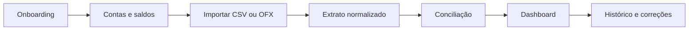

# Plano executável de conclusão do MVP

## Objetivo

Este documento é o mapa de implementação das funcionalidades do MVP do Talentum. Para cada módulo ele define:

- o que a funcionalidade faz;
- o fluxo esperado para a pessoa usuária;
- as rotas do Electron/Next.js;
- as APIs do backend local;
- as tabelas e relações por ID;
- as migrations necessárias;
- o critério verificável de conclusão.

O MVP estará completo quando uma pessoa puder se cadastrar na LP, obter com segurança o instalador correto, criar sua base financeira local, importar CSV ou OFX, revisar os lançamentos e consultar um Dashboard confiável. Todos os dados financeiros permanecem no SQLite local.

## Como executar este plano sem contexto anterior

1. Leia `docs/README.md` para conhecer a hierarquia das fontes de verdade.
2. Leia `ARCHITECTURE-WEB.md` para trabalho na LP/Cloudflare e `ARCHITECTURE-ELECTRON.md` para trabalho no aplicativo local.
3. Antes de alterar persistência, leia `DATA_MODEL.md` e `ESTRUTURA_DE_DADOS.md`; antes de alterar contratos ou login, leia `API.md`, `AUTHENTICATION.md` e `SECURITY.md`.
4. Compare o estado declarado nesta página com código, migrations e testes. Código verificável prevalece; corrija documentação desatualizada no mesmo change set.
5. Execute uma única etapa vertical por vez, incluindo backend, migration, contrato, interface, estados de UX, testes e documentação aplicáveis.
6. Não avance quando o critério “Concluída quando” da etapa atual não puder ser demonstrado.
7. Registre decisões com alternativas relevantes em `docs/decisions/`; não invente infraestrutura, credenciais ou requisitos ausentes.
8. Antes de commit/push, siga integralmente o gate de segurança de `CLAUDE.md` ou `CODEX.md`.

Estados usados neste documento:

- **Atual:** existe e foi verificado no repositório ou ambiente indicado.
- **Parcial:** existe apenas como scaffold ou parte do fluxo, sem atender ao critério de conclusão.
- **Planejada:** ainda deve ser implementada na ordem apresentada.
- **Em aberto:** exige decisão documentada antes da implementação.

## Regras obrigatórias

1. O frontend não acessa SQLite, Prisma ou arquivos financeiros diretamente.
2. O frontend solicita um código temporário, opaco e de uso único antes de cada chamada funcional ao backend.
3. O backend valida o código, entrada, autorização e contexto antes de consultar ou alterar dados.
4. Toda tabela possui `id`; toda relação usa foreign key terminada em `Id`.
5. Estruturas persistentes existem em migrations versionadas. Não se cria tabela manualmente durante a execução.
6. Prisma representa o schema aplicado pelas migrations; produção e Docker usam `prisma migrate deploy`.
7. Migrations aplicadas nunca são reescritas. Mudanças geram uma migration posterior.
8. Nenhum dado financeiro fictício fica no frontend. Sem registros no banco, a interface exibe estado vazio.
9. Valores monetários usam centavos inteiros/`BigInt`; nunca `Float`.
10. CSV e OFX reais de teste ficam em `temp/`, fora do Git.
11. A LP e o renderer nunca acessam D1 diretamente; toda ação cloud passa pelo BFF/Worker.
12. O sistema desktop, seu backend local e o SQLite nunca integram o artefato publicado na Vercel.

## Trilha cloud do MVP — cadastro, sessão e downloads

### O que faz

Entrega somente a API cloud, a LP pública e a página autenticada de downloads. O D1 persiste identidade mínima, sessões, consentimentos, releases e concessões; não recebe extratos, contas, saldos, transações, carteira ou chaves Pix.

### Estado atual verificável

- Worker `talentum` publicado em `talentum.luizflip9.workers.dev`;
- binding `DB` ligado ao D1 `talentum-cloud-production`;
- migration `cloudflare/migrations/0001_cloud_core.sql` aplicada;
- `GET /health` consulta o binding e responde sem expor dados internos;
- `workers.dev` habilitado explicitamente no `wrangler.jsonc`;
- configuração, comandos e segregação das migrations documentados em `CLOUDFLARE_SETUP.md`.

O endpoint de saúde e o schema não significam que autenticação, BFF, downloads ou feedback estejam implementados.

### Implementação local preparada em 10 de setembro de 2026

- Worker implementa action codes persistidos no D1, OAuth Google com PKCE, validação criptográfica do ID token, sessão curta, refresh rotativo, logout, perfil, releases e concessões;
- LP implementa BFF, cookies `HttpOnly`, callback, renovação, `/downloads` protegido e CSRF por validação de origem nas mutações;
- migration `0002_cloud_auth_runtime.sql` adiciona estado efêmero e rate limiting;
- CSP, HSTS, `no-store` e teste de isolamento do pacote web foram adicionados;
- migration aplicada no D1 local e remoto; cadastro dos segredos, configuração do OAuth, artefatos assinados e testes ponta a ponta no ambiente publicado continuam sendo ações operacionais obrigatórias.

### Ordem obrigatória do trabalho pendente

1. Corrigir no Cloudflare Git deployment os comandos para `pnpm run cloudflare:build` e `pnpm run cloudflare:deploy`, mantendo `main` como branch de produção.
2. Implementar configuração por ambiente e cadastrar segredos com Worker Secrets; valores reais nunca entram em `wrangler.jsonc`, `.env.example` ou Git.
3. Implementar o bootstrap de códigos efêmeros com hash, TTL, escopo de método/rota, uso único e consumo atômico.
4. Implementar OAuth/OIDC Authorization Code + PKCE, validação de `state`/`nonce`, callback e vínculo de identidade por ID.
5. Implementar sessão, access token curto, refresh token rotativo, detecção de reúso, revogação e logout.
6. Implementar o BFF da LP na Vercel com cookie first-party `Secure`, `HttpOnly` e sem token persistente acessível ao JavaScript.
7. Implementar LP/cadastro e `/downloads`, publicando na Vercel apenas a allowlist de arquivos web/BFF.
8. Implementar releases, artefatos, checksums, assinaturas e concessões de download curtas no backend.
9. Aplicar CORS exato, CSP, HSTS, CSRF, respostas privadas `no-store`, validação de entrada e erros genéricos.
10. Configurar rate limits separados para login, callback, refresh, código efêmero e download; ativar Turnstile de forma adaptativa contra abuso.
11. Habilitar logs e métricas redigidos, alertas e eventos de segurança sem tokens, e-mails públicos, IP bruto ou dados financeiros.
12. Implementar consentimento, privacidade, revogação de sessões, exclusão de conta e retenção mínima.
13. Produzir instaladores assinados de Windows e Linux fora da Vercel e publicar checksum, assinatura e metadados verificáveis.
14. Executar testes de autenticação, replay, rotação, autorização, rate limit, vazamento de deploy e download ponta a ponta.

### Rotas cloud do MVP

- `GET /health`
- `POST /api/action-codes`
- `POST /api/auth/start`
- `GET /api/auth/callback`
- `POST /api/auth/refresh`
- `POST /api/auth/logout`
- `GET /api/me`
- `GET /api/releases`
- `POST /api/releases/:releaseId/download-grants`

Os contratos, códigos de erro e proteções são definidos em `API.md` e `AUTHENTICATION.md` antes da implementação.

### Concluída quando

- uma pessoa não autenticada acessa a LP, mas não obtém a página protegida de downloads;
- cadastro/login, refresh, logout e revogação passam nos testes de segurança;
- Windows e Linux são oferecidos somente após autorização do backend;
- o artefato implantado na Vercel não contém Electron, Prisma, SQLite, parsers ou módulos financeiros;
- nenhum segredo aparece no bundle, repositório, logs ou resposta HTTP;
- o frontend não acessa D1, OAuth ou GitHub Releases diretamente.

## Fluxo principal do MVP

## Feature 1 — Onboarding financeiro

### O que faz

Cria a fotografia financeira inicial sem obrigar a pessoa a preencher tudo de uma vez. Permite cadastrar perfil, bancos, contas, saldos, renda, obrigações e investimentos, ou começar pela importação do extrato disponível.

### Fluxo

1. Explicar que dados financeiros ficam somente no dispositivo.
2. Criar ou retomar rascunho do onboarding.
3. Informar moeda e fuso.
4. Cadastrar instituições e contas.
5. Informar saldo atual ou anexar extrato.
6. Cadastrar renda e obrigações essenciais, quando conhecidas.
7. Revisar resumo e concluir.

### Rotas de interface

- `/onboarding`
- `/onboarding/perfil`
- `/onboarding/contas`
- `/onboarding/posicao-atual`
- `/onboarding/revisao`

### APIs locais

- `GET /api/onboarding`
- `POST /api/onboarding`
- `PATCH /api/onboarding/[onboardingId]`
- `POST /api/onboarding/[onboardingId]/complete`

### Tabelas

| Tabela | IDs e relações | Responsabilidade |
| --- | --- | --- |
| `LocalProfile` | `id` | identidade local sem dados bancários sensíveis |
| `UserPreference` | `id`, `profileId` | tema, moeda, idioma e fuso |
| `OnboardingSession` | `id`, `profileId` | etapa atual, status e retomada |
| `OnboardingAnswer` | `id`, `onboardingSessionId` | resposta validada por pergunta |

### Migration

- Criar `OnboardingSession` e `OnboardingAnswer` em migration própria.

### Concluída quando

- O onboarding pode ser interrompido e retomado, e o Dashboard continua vazio até o backend confirmar a existência de dados financeiros.

## Feature 2 — Instituições, contas e saldos

### O que faz

Representa os locais onde a pessoa possui dinheiro. Não exige agência ou número da conta. Chaves PIX próprias são opcionais, cifradas e usadas somente para reconhecer transferências entre contas da mesma pessoa.

### Fluxo

1. Cadastrar instituição pelo nome.
2. Criar uma ou mais contas ligadas por `institutionId`.
3. Informar tipo e moeda da conta.
4. Registrar o saldo conhecido com data de referência.
5. Opcionalmente cadastrar identificadores PIX locais cifrados.

### Rotas de interface

- `/contas`
- `/contas/nova`
- `/contas/[accountId]`

### APIs locais

- `GET|POST /api/institutions`
- `GET|PATCH|DELETE /api/institutions/[institutionId]`
- `GET|POST /api/accounts`
- `GET|PATCH|DELETE /api/accounts/[accountId]`
- `POST /api/accounts/[accountId]/balance-snapshots`
- `GET|POST /api/accounts/[accountId]/pix-identifiers`

### Tabelas

| Tabela | IDs e relações | Responsabilidade |
| --- | --- | --- |
| `Institution` | `id`, `profileId` | instituição financeira |
| `Account` | `id`, `profileId`, `institutionId` | conta, tipo, moeda e estado |
| `BalanceSnapshot` | `id`, `accountId` | saldo conhecido em uma data |
| `PixIdentifier` | `id`, `accountId` | hash para comparação e valor cifrado local |

### Migration

- `mvp_financial_core` já cria `Institution`, `Account` e `BalanceSnapshot`.
- Migration posterior cria `PixIdentifier` e seus índices.

### Concluída quando

- Criar, editar ou desativar uma conta atualiza o seletor e o saldo consolidado por consulta ao backend.

## Feature 3 — Categorias, rendas e obrigações

### O que faz

Cria a estrutura usada para interpretar receitas, despesas, transferências e valores comprometidos no mês.

### Rotas de interface

- `/configuracoes/categorias`
- `/planejamento/rendas`
- `/extratos/recorrencias`

### APIs locais

- `GET|POST /api/categories`
- `GET|PATCH|DELETE /api/categories/[categoryId]`
- `GET|POST /api/incomes`
- `GET|POST /api/obligations`
- `GET|PATCH|DELETE /api/obligations/[obligationId]`

### Tabelas

| Tabela | IDs e relações | Responsabilidade |
| --- | --- | --- |
| `Category` | `id`, `profileId` | classificação de receita, despesa ou transferência |
| `IncomeSource` | `id`, `profileId`, `accountId?` | renda prevista ou recorrente |
| `ScheduledObligation` | `id`, `profileId`, `accountId?`, `categoryId?` | compromisso com valor e vencimento |
| `MerchantRule` | `id`, `profileId`, `categoryId` | regra determinística de categorização |

### Migration

- `mvp_financial_core` já cria `Category`.
- `mvp_scheduled_obligations` já cria `ScheduledObligation`, consumida pelo Dashboard. O CRUD e a tela de recorrências continuam pertencendo a esta feature.
- Migration posterior cria renda e regras de estabelecimento.

### Concluída quando

- O frontend lista somente categorias e obrigações retornadas pelo backend, e o total comprometido possui teste unitário.

## Feature 4 — Importação CSV e OFX

### O que faz

Transforma um arquivo bancário em um lote rastreável de transações locais. CSV exige mapeamento de colunas porque bancos podem usar cabeçalhos, separadores, datas e sinais diferentes.

### Fluxo

1. Selecionar `.csv` ou `.ofx`.
2. Backend validar tamanho, tipo real, encoding e conteúdo.
3. Calcular fingerprint antes de importar.
4. No CSV, detectar separador e solicitar mapeamento de colunas.
5. Mostrar prévia sem gravar transações.
6. Confirmar conta, datas, sinal de débito/crédito e saldo.
7. Gravar lote e transações em uma transação SQLite.
8. Enviar itens incertos para conciliação.

### Rotas de interface

- `/extratos/importar`
- `/extratos/importar/[importBatchId]`
- `/extratos/importar/[importBatchId]/mapeamento`
- `/extratos/importar/[importBatchId]/revisao`

### APIs locais

- `POST /api/imports/inspect`
- `POST /api/imports`
- `GET /api/imports/[importBatchId]`
- `PATCH /api/imports/[importBatchId]/mapping`
- `POST /api/imports/[importBatchId]/confirm`
- `DELETE /api/imports/[importBatchId]`

### Tabelas

| Tabela | IDs e relações | Responsabilidade |
| --- | --- | --- |
| `ImportBatch` | `id`, `profileId` | formato, fingerprint, estado e totais do lote |
| `ImportFile` | `id`, `importBatchId` | metadados mínimos; conteúdo bruto não é retido por padrão |
| `CsvMappingProfile` | `id`, `profileId`, `institutionId?` | mapeamento reutilizável de colunas |
| `ImportIssue` | `id`, `importBatchId`, `transactionId?` | erro ou aviso por linha/campo |
| `Transaction` | `id`, `profileId`, `accountId`, `importBatchId`, `categoryId?` | lançamento normalizado |

### Migration

- `mvp_financial_core` já cria `ImportBatch` e `Transaction`.
- Migration posterior cria `ImportFile`, `CsvMappingProfile` e `ImportIssue`.

### Concluída quando

- CSV e OFX sintéticos importam corretamente; reenviar o mesmo arquivo não duplica dados; erro em uma linha não produz lote parcialmente confirmado.

## Feature 5 — Extratos e transações

### O que faz

Exibe os lançamentos persistidos com paginação, filtros, origem do lote e estado de conciliação.

### Rotas de interface

- `/extratos`
- `/extratos/[transactionId]`

### APIs locais

- `GET /api/transactions`
- `GET|PATCH /api/transactions/[transactionId]`
- `GET /api/transactions/[transactionId]/history`

### Consulta

- Filtros e ordenação são validados no backend.
- A API retorna IDs opacos e DTOs mínimos.
- O frontend não calcula saldo nem reclassifica dados sozinho.

### Concluída quando

- Sem transações, a rota apresenta estado vazio; com registros, cada linha corresponde a uma `Transaction.id` retornada pelo backend.

## Feature 6 — Conciliação

### O que faz

Permite confirmar ou corrigir transações incertas sem apagar o dado original. Reconhece categoria, transferência entre contas próprias, obrigação e ajuste financeiro.

### Fluxo

1. Backend cria pendência com motivo e confiança.
2. Frontend solicita o próximo item.
3. Pessoa confirma ou corrige.
4. Backend registra decisão, antes/depois e autor local.
5. Cálculos e Dashboard são atualizados.
6. Decisão pode ser revertida.

### Rotas de interface

- `/conciliacao`
- `/conciliacao/[reconciliationItemId]`

### APIs locais

- `GET /api/reconciliation-items`
- `GET /api/reconciliation-items/[reconciliationItemId]`
- `POST /api/reconciliation-items/[reconciliationItemId]/decisions`
- `POST /api/reconciliation-decisions/[decisionId]/revert`

### Tabelas

| Tabela | IDs e relações | Responsabilidade |
| --- | --- | --- |
| `ReconciliationItem` | `id`, `transactionId` | pendência, motivo e confiança |
| `ReconciliationDecision` | `id`, `reconciliationItemId`, `profileId` | decisão e antes/depois |
| `FinancialAdjustment` | `id`, `transactionId`, `decisionId?` | juros, multa, desconto ou correção |
| `OwnAccountTransfer` | `id`, `outgoingTransactionId`, `incomingTransactionId` | pareamento entre contas próprias |

### Concluída quando

- Nenhuma correção destrói o valor original e toda decisão relevante pode ser auditada e revertida.

## Feature 7 — Dashboard

### O que faz

Resume a posição atual usando somente consultas do backend. O Dashboard vive em `/dashboard`; a raiz `/` é o Início do sistema, uma porta de entrada sem número financeiro. O conjunto de indicadores e gráficos, com a fórmula e a viabilidade de cada um, está em [`DASHBOARD.md`](./DASHBOARD.md).

### Indicadores do MVP

O conjunto, a forma e a fórmula de cada elemento estão em [`DASHBOARD.md`](./DASHBOARD.md), Parte 5.

- **Saldo Livre de Risco**, veredito da tela, com período e decomposição visíveis;
- saldo consolidado: último snapshot de cada conta ativa **mais os lançamentos posteriores a ele**, com as contas sem saldo informado contadas à parte;
- gastos do mês, com variação contra o mesmo intervalo de dias do mês anterior;
- média diária, com a mesma base de comparação;
- total comprometido no período e quantidade de obrigações;
- fila de conciliação como faixa de atenção;
- gastos por categoria.

Fluxo mensal de entradas e saídas continua **bloqueado**: `ImportBatch` não registra o período coberto, então um mês sem extrato seria renderizado como um mês sem movimento (lacuna L-2).

### Rotas de interface

- `/dashboard`

A raiz `/` é o Início: apresenta o produto, o aviso de privacidade local, a ação de importar ou cadastrar a posição e os atalhos para as áreas. Ela não exibe valor financeiro — um zero sem confirmação do backend é uma afirmação falsa. O Início não possui item próprio na navegação lateral: chega-se a ele pela marca no topo da sidebar.

### APIs locais

- `GET /api/dashboard`
- `GET /api/dashboard/categories`
- `GET /api/dashboard/cash-flow`
- `GET /api/dashboard/risk-free-balance`

### Tabelas consultadas

- `Account`, `BalanceSnapshot`, `Transaction`, `Category`, `ImportBatch` e `ScheduledObligation`.
- `ReconciliationItem` ainda não existe: a fila usa `Transaction.status = 'pending'` como aproximação declarada até a migration de conciliação.

### Estado atual

`GET /api/dashboard` e `GET /api/dashboard/categories` consultam o SQLite pelo backend, exigem `X-Action-Code` e são escopados por `profileId`. O Saldo Livre de Risco, o saldo consolidado, os gastos do mês, a média diária, o comprometido no período e os gastos por categoria estão implementados, com fórmulas em módulo puro e testes unitários.

A interface possui os quatro estados: esqueleto no carregamento, faixa de erro com repetição, estado vazio e estado com dados. **Nenhum valor é renderizado sem confirmação do backend** — com a consulta indisponível a tela informa a falha em vez de exibir `R$ 0,00`.

### Concluída quando

- Nenhum indicador vem de constante do frontend; alterar uma transação ou obrigação altera o Dashboard; fórmulas possuem testes unitários. **Atendido**, exceto o teste ponta a ponta automatizado, que depende do fluxo de importação da Feature 4.

## Feature 8 — Histórico, reversão e segurança local

### O que faz

Registra importações e alterações relevantes sem guardar o código temporário, segredos ou conteúdo bruto do extrato.

### Rotas

- `/historico`
- `GET /api/timeline-events`
- `POST /api/timeline-events/[timelineEventId]/revert`

### Tabelas

| Tabela | IDs e relações | Responsabilidade |
| --- | --- | --- |
| `TimelineEvent` | `id`, `profileId`, `importBatchId?`, `transactionId?` | evento redigido e reversível |
| `DatabaseBackup` | `id`, `profileId` | metadados do backup local anterior a migration destrutiva |

### Concluída quando

- Eventos podem ser consultados sem expor segredos e migrations destrutivas exigem backup local validado.

## Ordem de migrations do MVP

| Ordem | Migration | Tabelas principais | Estado |
| --- | --- | --- | --- |
| 1 | `init` | `LocalProfile`, `UserPreference` | criada |
| 2 | `mvp_financial_core` | `Institution`, `Account`, `BalanceSnapshot`, `Category`, `ImportBatch`, `Transaction` | criada |
| 3 | `mvp_onboarding` | `OnboardingSession`, `OnboardingAnswer` | planejada |
| 4 | `mvp_scheduled_obligations` | `ScheduledObligation` | criada |
| 4b | `mvp_financial_planning` | `IncomeSource`, `MerchantRule`, `PixIdentifier` | planejada |
| 5 | `mvp_import_details` | `ImportFile`, `CsvMappingProfile`, `ImportIssue` | planejada |
| 6 | `mvp_reconciliation` | `ReconciliationItem`, `ReconciliationDecision`, `FinancialAdjustment`, `OwnAccountTransfer` | planejada |
| 7 | `mvp_timeline_backup` | `TimelineEvent`, `DatabaseBackup` | planejada |

## Ordem de implementação das features

1. Concluir a trilha cloud de cadastro, sessão e autorização de downloads.
2. Implementar onboarding persistente.
3. Concluir instituições, contas e snapshots.
4. Implementar categorias, rendas e obrigações.
5. Implementar inspeção e mapeamento de CSV.
6. Implementar parser e importação transacional de CSV/OFX.
7. Implementar listagem real de extratos.
8. Implementar conciliação e reversão.
9. Concluir Dashboard e Saldo Livre de Risco.
10. Implementar histórico, backup de migrations e testes ponta a ponta.
11. Empacotar, assinar, publicar e validar Windows e Linux.

## Definition of Done do MVP

- Todas as features acima atendem seus critérios de conclusão.
- Todas as tabelas existem por migrations e possuem IDs e foreign keys documentados.
- Todas as telas financeiras consultam o backend e possuem estados vazio, carregando, erro e com dados.
- Nenhum valor, transação, conta, categoria ou pessoa fictícia permanece no frontend.
- Toda chamada funcional usa código temporário de uso único e proteção contra replay.
- CSV e OFX sintéticos passam nos testes; arquivos reais ficam fora do Git.
- O SQLite é criado e atualizado com `prisma migrate deploy` no desenvolvimento, Docker e aplicativo empacotado.
- Builds Windows e Linux são reproduzíveis, assinados e verificáveis.
- LP, BFF, Worker, D1 e fluxo de download atendem a trilha cloud e seus testes de segurança.
- O contexto publicado na Vercel contém somente LP/BFF, comprovado por inspeção do artefato.
